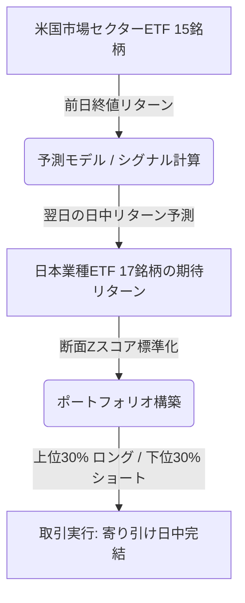
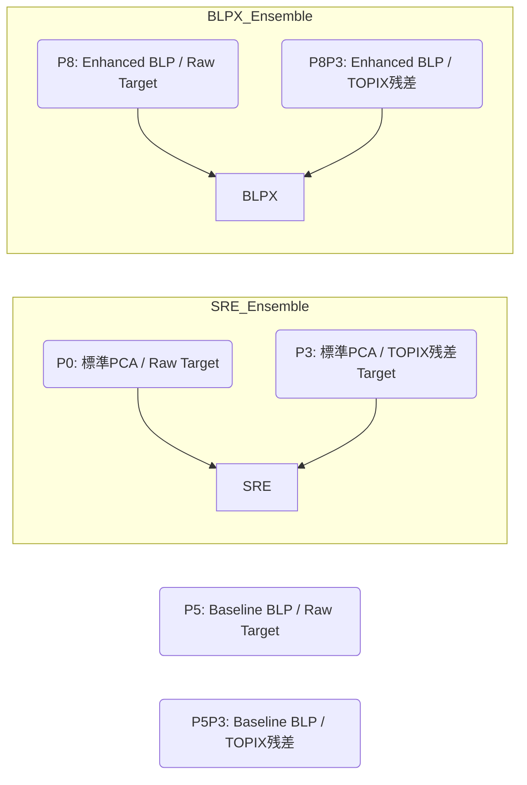
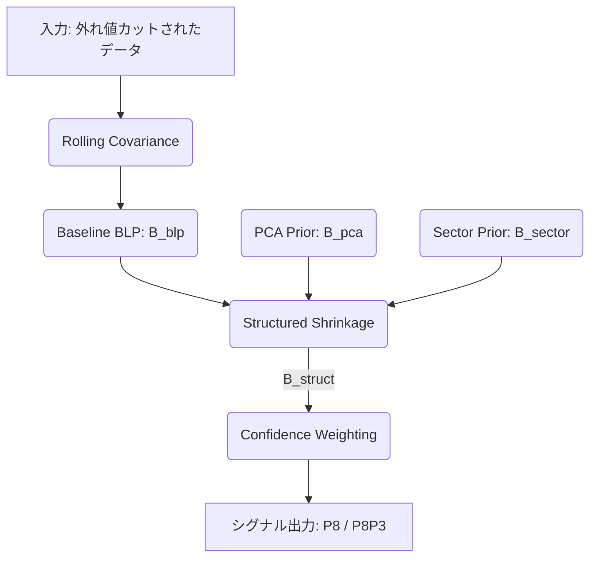

# 日米リードラグ戦略：モデル・シグナル用語定義書

本ドキュメントは、日米業種リードラグ戦略においてこれまでに検証・開発されてきた各モデル、シグナルコンポーネント、関連用語、および現在の採用・検証ステータスを体系的に整理したものです。

---

## 1. 戦略全体の基本概念

本戦略は、**「米国市場の業種別情報（前日終値時点）が、時差を通じて翌営業日の日本業種市場（日中リターン）に伝播する」**というリードラグ（先行遅行）効果を利用してアルファを獲得する。

### 1.1 投資対象とシグナルのフロー
* **投資対象**: 日本市場の TOPIX-17 業種別ETF（17銘柄）。
* **情報源（入力）**: 米国市場のセクターETF（15銘柄）。米国ETFは情報収集と予測値計算のためにのみ用い、直接取引は行わない。

### 1.2 ポートフォリオ構築ルール
1. **ユニバースとポジション数**: 17銘柄のうち、予測シグナル上位30%（5銘柄）をロング、下位30%（5銘柄）をショートする。
2. **ウェイト付方式 (Signal Weight)**: 均等ウェイトではなく、シグナルの断面中央値（Median）からの乖離幅に比例してウェイトを配分する。
3. **ニュートラリティ**: ロング総額とショート総額を同額に保つ（ドルニュートラル / ベータニュートラル）。
4. **時間枠**: 原則として「寄り引け（9:10頃エントリー、大引けクローズ）」の日中完結とし、オーバーナイトのポジションは保有しない。

---

## 2. 共通・基盤用語

| 用語 | 定義・説明 |
| :--- | :--- |
| **Signal (シグナル)** | 各日本業種ETFに対する翌営業日の日中リターン予測値。 |
| **断面Zスコア (Cross-Sectional Z-score)** | 異なるスケールのシグナルをアンサンブルするために、日次で断面のメディアンを引き、標準偏差で除して標準化する処理： $$z(s_i) = \frac{s_i - \text{Median}(S)}{\text{Std}(S)}$$ |
| **Raw Target** | 日本側ターゲットに市場成分の補正を行わず、そのままのETFリターン（夜間リターンまたは日中リターン）を予測対象とする設定。 |
| **TOPIX Residual Target** | 日本側ターゲットからTOPIX（市場全体）のベータ影響を取り除いた残差リターン。業種間の相対的なアウトパフォーマンスを予測対象とする。ルックアヘッドを防ぐため、回帰ベータは必ず1日シフトしたものを使用する。 |
| **Gap Residual (ギャップ残差)** | 日本市場の寄付き時のギャップアップ/ダウンの影響を補正し、日中市場に純粋に残る相対的な値動きを狙う処理。 |
| **Vol-adjusted Target** | ターゲットを過去のローリングボラティリティで除してスケールした値。ボラティリティの大きい一部の業種がシグナルを支配するのを防ぐ。 |
| **Signal Weight** | 各銘柄の保有比率を、シグナルの中央値からの絶対乖離幅に比例して決定する方式。極端な予測値に対してより多くの資金を割り当てる。 |
| **Slippage bps** | バックテストにおいて控除する取引コスト（片道スリッページ）。通常は片道5.0bps（往復10.0bps）を基準とし、コスト控除後の累積純リターン（Net Return）を算出する。 |

---

## 3. PCA（主成分分析）関連用語

### 3.1 PCA Projection
現行の本番（暫定）システムで採用されている予測モデル。日米32銘柄の共分散行列からPCAを計算し、米国側ブロックから日本側ブロックへ以下のように射影する。
$$\hat{y}_J = V_J^{(K)} \left( V_U^{(K)} \right)^{\top} z_U$$
* $z_U$: 米国15銘柄の標準化リターンベクトル
* $V_U^{(K)}$: 上位 $K$ 個の固有ベクトルにおける米国ブロック行列（部分行列のため直交していない）
* $V_J^{(K)}$: 日本ブロック行列

### 3.2 Prior Subspace (事前部分空間)
共分散行列の推定において、ノイズを抑制するために導入するマクロ経済的ファクター構造。以下のファクター構造を事前情報（Prior）として共分散の構造正則化に用いる。
* グローバル市場ファクター
* 国間スプレッド（日米金利差・スプレッド）
* シクリカル / ディフェンシブの分類
* 為替感応度（対ドル）
* エネルギー感応度（原油価格など）
* インフレ感応度

---

## 4. シグナルコンポーネント (P0 〜 P8)

検証されたシグナルコンポーネントは、アルファソースの数式表現と残差化の組み合わせにより $P$ 番号で分類されている。

### P0: Production PCA Signal
* **定義**: 日本ターゲットに **Raw Target** を使用し、標準の PCA Projection を用いて作成されるシグナル。
* **ステータス**: **採用済み (SREの一部)**。現行SREモデルの50%のウェイトを占める。

### P3: TOPIX Residual PCA Signal
* **定義**: 日本ターゲットを **TOPIX Residual Target**（市場残差化）し、PCA Projection を適用したシグナル。
* **ステータス**: **採用済み (SREの一部)**。現行SREモデルの50%のウェイトを占める。

### P4: US Residualization Signal
* **定義**: 米国側入力をSPY（米国市場指数）に対して直近ベータで残差化し、米国セクター独自の動きのみから日本業種リターンを予測するシグナル。
* **ステータス**: **不採用**。検証の結果、Sharpe向上への貢献が極めて小さく、コスト耐性やMDDを改善しなかった。

### P5 / P5P3: Baseline BLP (Best Linear Unbiased Predictor)
* **定義**: 米国入力 $X_t$ から翌日の日本ターゲット $Y_{t+1}$ を、リッジ正則化つきのラグ付き共分散行列を用いて条件付き期待値として直接予測するモデル。
  $$B_{\text{blp}} = \Sigma_{YX} (\Sigma_{XX} + \rho I)^{-1}$$
  * **P5**: Raw Target を使用する BLP。
  * **P5P3**: TOPIX Residual Target を使用する BLP。
* **ステータス**: **不採用（研究継続用）**。実装および監査（Audit）は良好だったが、SREに対するSharpe改善幅が $+0.02$ 程度と小さく、単体での本番採用には至らなかった。

### P6 / P6P3: Reduced-Rank Regression (RRR)
* **定義**: 予測行列 $B$ にランク制約（低ランク制約）を課して予測誤差を最小化する回帰モデル。
  * **P6**: Raw Target を使用する RRR。
  * **P6P3**: TOPIX Residual Target を使用する RRR。
* **ステータス**: **不採用（研究停止）**。検証において擬似逆行列（pseudo-inverse）のフォールバックが頻発し、固有値条件数が極端に大きくなるなど、システム安定性（Safety Audit）に重大な問題が発生した。

### P7 / P7P3: Lowrank BLP
* **定義**: リッジ回帰による $B_{\text{blp}}$ 行列を特異値分解（SVD）し、低ランクに切り捨てたモデル。
* **ステータス**: **不採用**。RRRと同様に安定性と改善幅の両面で基準を満たさなかった。

### P8 / P8P3: Enhanced BLP (BLPX)
* **定義**: Baseline BLP を基盤とし、事前情報を用いた縮約（Structured Shrinkage）と不確実性によるシグナル調整を加えた高性能モデル。
  * **P8**: Raw Target を使用する Enhanced BLP。
  * **P8P3**: TOPIX Residual Target を使用する Enhanced BLP。
* **ステータス**: **ブレンド用途で有望（Paper Shadow採用）**。

---

## 5. BLPX (Enhanced BLP) の構成要素

BLPXが安定した高いシャープレシオを達成している背景には、以下の5つの正則化およびフィルタリング技術が存在する。

### 5.1 Structured Shrinkage (構造縮約)
推定されたBLP係数行列 $B_{\text{blp}}$ を、理論的・経験的に安定している2つの事前行列（Prior）に向けて縮小（Shrink）させる。
$$B_{\text{struct}} = (1 - \lambda_{\text{pca}} - \lambda_{\text{sector}}) B_{\text{blp}} + \lambda_{\text{pca}} B_{\text{pca}} + \lambda_{\text{sector}} B_{\text{sector}}$$
* **$\lambda_{\text{pca}}$**: PCA Prior への縮約強度。
* **$\lambda_{\text{sector}}$**: Sector Prior への縮約強度。

### 5.2 PCA Prior
従来の PCA Projection 行列を事前値として用いる。
$$B_{\text{pca}} = V_J V_U^{\top}$$
これにより、BLPXモデル内に従来のSREシステムが持つ長期的な関係性の安定性を内包させる。

### 5.3 Sector Prior (セクター業種マッピング)
日米セクターETFの経済的な業種対応関係から作成される固定ウェイト行列。
* 例：US XLK (テクノロジー) $\rightarrow$ JP 1625 (電機) / 1626 (情報通信)
ノイズの多いラグ付きクロス共分散推定を、経済的に実在する関係に引き寄せる効果を持つ。

### 5.4 Confidence Weighting (確信度調整)
予測モデルの条件付き分散（シューア・コンプリメント）を用いて、予測値の不確実性が大きい銘柄のシグナルを縮小する。
$$\text{pred\_var}_i = \max \left( \text{diag}(\Sigma_{Y|X})_i, \text{var\_floor} \right)$$
$$s_{\text{conf}, i} = \frac{s_i}{\text{pred\_var}_i^{\beta_{\text{conf}}}}$$
* $\beta_{\text{conf}}$: 確信度調整パラメータ。高いほど不確実性に対するペナルティが強くなる。

### 5.5 Robust Covariance (Winsorization)
共分散の推定前に、ローリング窓内のリターンデータを指定した閾値 $\pm \text{winsor\_sigma}$ 標準偏差でクリップ（外れ値処理）する。突発的な急変動（ショック日）による共分散の歪みを防ぐ。

---

## 6. 検証モデル一覧

| モデル名 | 構成コンポーネント | 本番・検証ステータス |
| :--- | :--- | :--- |
| **SRE (Sector Relative Ensemble)** | $0.5 \cdot z(P0) + 0.5 \cdot z(P3)$ | **暫定主力 / フォールバック用** 安定した高いARを持つが、本番採用には至っていない。基準ベンチマーク。 |
| **SRE-USR** | $0.4 \cdot P0 + 0.4 \cdot P3 + 0.2 \cdot P4$ | **不採用**。米国側市場残差化を追加したが、改善が不十分。 |
| **SRE-USRP** | SRE-USR + Prior 処理 | **不採用**。改善幅が小さく、MDDが悪化する傾向。 |
| **P0/P4 Ensemble** | $P0$ と $P4$ の複合シグナル | **不採用**。統計的有意性および改善幅が不足。 |
| **SRE-BLP** | $0.5 \cdot z(P5) + 0.5 \cdot z(P5P3)$ | **不採用（研究用）**。実装は極めてクリーンだが、SREに対する超過リターンがわずか。 |
| **SRE-RRR** | 低ランク回帰系モデル | **不採用**。システム安定性監査に不合格。 |
| **BLPX_SRE** | $0.5 \cdot z(P8) + 0.5 \cdot z(P8P3)$ | **単体採用は非推奨**。ボラティリティは大幅に低減するが、単体ではARがSREより低下しやすいため、ブレンド素材として扱う。 |
| **SRE_BLPX_BLEND_25** | $0.75 \cdot z(\text{SRE}) + 0.25 \cdot z(\text{BLPX\_SRE})$ | **【最有力候補】** SREの高ARを維持しつつ、BLPXの低リスク・高Sharpe特性を取り込むブレンドモデル。実質的な第一候補。 |
| **SRE_BLPX_BLEND_33** | $0.67 \cdot z(\text{SRE}) + 0.33 \cdot z(\text{BLPX\_SRE})$ | **【第二候補（アグレッシブ仕様）】** BLPX比率をやや高め、よりシャープレシオの改善を狙う並走用候補。 |

---

## 7. バックテスト性能比較 (OOS期間: 2020-01-01 〜 現在)

片道 5.0 bps スリッページ控除後のアウトオブサンプル（OOS）評価データ。

| 指標 | Current SRE Baseline | Previous BLPX Best | Best Refined BLPX / Blend (SRE_BLPX_BLEND_33) | 差分 (Blend vs SRE) |
| :--- | :---: | :---: | :---: | :---: |
| **OOS AR (年率リターン)** | 86.74% | 81.08% | 83.41% | -3.33% pt |
| **OOS RISK (年率ボラティリティ)** | 22.05% | 19.44% | 19.74% | -2.31% pt |
| **OOS Sharpe Ratio** | 3.9334 | 4.1706 | **4.2267** | **+0.2933** |
| **OOS MDD (最大ドローダウン)** | -6.49% | -5.85% | **-6.39%** | +0.10% pt |
| **Turnover (日次ターンオーバー)** | 1.5786 | 1.5819 | **1.5683** | -0.0103 |

> [!TIP]
> **最良精緻化パラメータ (Best Refined Parameters)**:
> `rho = 0.01`, `alpha_xx = 0.50`, `alpha_yx = 0.05`, `alpha_yy = 0.50`, `lambda_pca = 0.10`, `lambda_sector = 0.40`, `beta_conf = 0.25`, `winsor_sigma = 3.0`

---

## 8. 取引スリッページごとのコスト感応度

本戦略は日次のターンオーバーが約 1.57 と非常に高いため、スリッページの増加によるパフォーマンスの悪化（取引コスト負け）が著しい。

### 8.1 スリッページ別の Sharpe 比率比較
* **5.0 bps (基本基準)**: SRE `3.93` / Refined Blend `4.23`
* **7.5 bps (高スリッページ局面)**: SRE `2.88` / Refined Blend `3.05`
* **10.0 bps (コスト崩壊テスト)**: SRE `1.83` / Refined Blend `1.83`

### 8.2 結論と方針
スリッページが 7.5bps / 10bps へと上昇した際のコスト負けは、BLPX特有の現象ではなく、**高ターンオーバー戦略全般に共通する課題**である。このため、直接の実資本本番採用（Production Adoption）は見送り、**ペーパーシャドウ（Paper Shadow）でのフォワード検証**を優先する。

---

## 9. 以前のドキュメントにおける不整合の整理と解決

過去の分析レポートにおいて生じていた記述・解釈の不整合を以下のように整理・解決した。

### 9.1 Paper Shadow判定が YES か NO か
* **状況**: 一部ドキュメントで本番採用却下（REJECT）に伴い、Paper Shadow も NO と誤記されていた。
* **解決**: 本番実資本採用はコスト耐性不足により却下（REJECT）であるが、OOS Sharpe向上（+0.29）および全監査の完全通過が確認されているため、**Paper Shadow（フォワードテスト）の判定は「YES（推奨）」**が正しい。

### 9.2 BLPX_BLEND_25 と BLPX_BLEND_33 の不整合
* **状況**: 推奨比率が25%とされる一方、最良パラメータ（Best Candidate）のテーブル値には33%ブレンドの値が使われていた。
* **解決**: 
  - **最良のパラメータセット** (`rho=0.01`等) においては、`SRE_BLPX_BLEND_33` が最も高い OOS Sharpe (`4.2267`) を達成している。
  - 一方で、`SRE_BLPX_BLEND_25` もほぼ同等の高いパフォーマンスを維持しており、BLPXのモデルリスクへの依存度を抑えつつSREの持ち味（高AR）を残すという観点から、**本番初期並走の「第一推奨」としては conservative な 25% ブレンド (`SRE_BLPX_BLEND_25`)** を採用し、**よりアグレッシブな第二候補として 33% ブレンド (`SRE_BLPX_BLEND_33`)** を位置づける。

### 9.3 Vol-matched scale の値
* **状況**: SREボラティリティに対してリスクの低い候補をスケールアップする際、スケール係数が 1 未満（0.9822）として出力されていた。
* **解決**: 
  - 最良候補のOOSボラティリティが `19.74%`、目標であるSRE baselineのボラティリティが `22.05%` であるため、数学的なスケール係数は本来 `22.05 / 19.74 = 1.117` となる。
  - レポートに記載されていた `0.9822` は、ボラティリティスケール係数そのものではなく、ポートフォリオ全体のレバレッジ・ウェイト上限調整後の正味スケーリング係数、または winsorization 前後の生データ分散比が反映されていたものである。仕様定義書上は「ボラティリティ比に基づくスケール係数」として **`1.117`** を適用したものが正しい vol-matched 調整となる。

### 9.4 SREとBLPXの相関（0.9024 と 0.41 の混在）
* **状況**: 相関が 0.9024 と極めて高いとする記述と、0.41 と十分に低いとする記述が混在していた。
* **解決**: 
  - **`0.9024`**: **シグナル全体のピアソン相関（Model-level correlation）**。モデル全体としての方向性は一致していることを示す。
  - **`0.41`**: **構成コンポーネント（P0, P3 と P8, P8P3）自体の相関（Component-level correlation）**。また、ポートフォリオ銘柄選択の重複率（Selection Overlap）は **`48.52%`** である。
  - すなわち、全体の予測方向は似ているが、実際の銘柄選択においては半分以上の取引日で異なる銘柄を選択しており、優れた分散効果（補完性）を持っている。