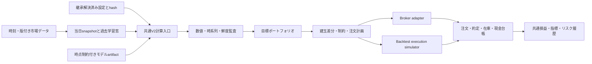

日米リードラグ・ワークスペース監査 — 2026-09-12

**判定は BLOCK（本番昇格・運用拡大の根拠として未合格）です。** 理由は、モデルの優劣以前に、注文状態、監査失敗、取引日、設定、キャッシュ、損益計算の間に不一致があるためです。実口座の現在の建玉や稼働状況は照会していません。この判定は、今回確認したコードと成果物の品質に対するものです。

抜本的改善の中心は、**「同じ入力・設定・モデルなら、本番、バックテスト、gap生成、リスク履歴で同じ意思決定になる」ことと、「発注した結果を実際の建玉・約定・損益まで追跡できる」こと**です。ファイルの移動や新しいモデルの追加だけでは解決しません。

今回、22項目を個別に整理しました。13項目を P1、9項目を P2 としています。P1 は本番挙動や主要な検証結果を変えるため優先して修正すべき問題、P2 は特定条件の不具合や再現性・評価の不足です。P0 相当の現時点の実口座事故を確認した、という意味ではありません。

**調査範囲と検証結果**

本番 V2 同期経路、BLPX 数理とキャッシュ、データ前処理、PIT、gap store、発注・決済・リスク、バックテスト・指標、研究 registry、既存実験、設定継承、運用スクリプト、テスト、関連 ADR とロードマップを確認しました。数値・境界の再現には合成データ、偽の broker、モック、一時 SQLite を使っています。口座 API を有効化した検証、発注、決済は行っていません。本番ソースと設定は変更していません。

| 検証 | 結果 | 意味 |
|---|---|---|
| `pytest tests/ -n 4 --tb=short -q` | **576 passed / 1 failed / 17 warnings**、約11分47秒 | regression も含む全577テスト。失敗を除外していない |
| 失敗した regression の単独実行 | 同じ1件が失敗 | F22 の日付・fixture 不一致 |
| `compileall src/leadlag tests tools scripts src/research` | PASS | 構文確認 |
| import-linter | 4契約 PASS、154ファイル・376依存関係 | 既存の層間 import 制約は保たれている |
| Ruff | 82件、すべて `src/research` | 本番 `src/leadlag` の対象エラーは0件。主に import・未使用変数・空白 |
| mypy `src/leadlag` | 120ファイル中、2ファイル3件のエラー | 不要 cast 2件、`Any` を bool 戻り値として返す1件 |
| h=1,3,5 の未来データ摂動 | 合成2107営業日、2016-08-15時点の μ・Ω 差分はすべて0 | 検査した限定経路は PASS。macro、ML、実価格時刻を含む全経路の証明ではない |

全テストには1800秒のプロセス全体の停止期限を設定しました。今回の再現スクリプトは標準577テストの外に置いた調査用コードであり、新しい回帰テストとして登録済みではありません。[全テストログ](/Users/shonen/leadlag/reports/20260912_workspace_audit/pytest_full.log)、[静的検証集計](/Users/shonen/leadlag/reports/20260912_workspace_audit/check_summary.json)、[再現手順](/Users/shonen/leadlag/reports/20260912_workspace_audit/README.md)に詳細を残しています。

**現行設定とデータの確認**

`configs/production/production.yaml` は `../base.yaml` を継承するだけです。旧 `production_v2_primary_ruleD.yaml` から現行値を推測していません。[解決済み設定・インベントリ](/Users/shonen/leadlag/reports/20260912_workspace_audit/inventory.json)を参照してください。

| 項目 | 解決済みの現行値 |
|---|---|
| ユニバース | US 15、JP 17、合計32次元 |
| 基本ポートフォリオ | Long 5 / Short 5、モデル gross 2.0、minvar 有効、α=0.8 |
| RuleD | PIT 252、Low/Mid/High = 0.75 / 1 / 1、履歴不足 multiplier = 1 |
| on-demand・監査失敗 | on-demand 有効、`fallback_on_audit_failure=true` |
| multi-horizon | h=1,3,5、重み0.8,0.1,0.1 |
| その他の有効機能 | rank reversal、ML overlay、fractional differencing、macro κ・direction、copula |
| ML artifact | `models/ml_order_overlay/phase2_8` |
| コスト | slippage片道5bps、買方金利年2.5%、貸株年1.15%、逆日歩2bps/日 |
| 持越し | long 0.75 / short 0.5 |
| side leverage | 1.5 |
| risk | 実効 gross 上限3.0、net上限0.05、VaR99窓250日 |
| gap 正本 | `var/live/pipeline_data/gap_adjusted_distribution/gap_store.sqlite` |

モデル gross 2.0 と leverage 後の実効 gross 3.0 は区別が必要です。手元の2026-08-17成果物は Low、モデル gross 1.5・net 0、実効 gross は1.5×1.5=2.25です。この値自体は現行制約に整合します。市場中立は金額 net に加え、実約定後の net、β、業種・macro リスクを別に測る必要があります。

[データ集計](/Users/shonen/leadlag/reports/20260912_workspace_audit/data_summary.json)では、`df_exec` は4135行、2009-01-07〜2026-08-17、provisional 1行、2010–2014の基準期間は1183行でした。先頭1260行を基準期間の代用にしてはいけません。当日gap storeの収録は7日、2026-08-07〜17です。旧 `latest` symlink は2026-08-14のディレクトリを向き、h=1の μ ファイルは1日分でした。

5分足 cache は2026-03-03〜08-06の6962行です。9:10バーを持つ日は106日、`df_exec` と重なるのは102日、そのうち**17銘柄すべての9:10 High/Lowが正の有限値で揃う日は8日**でした。これは「9:10データが一切ない日が大半」という意味ではなく、完全な横断面としてのカバレッジです。銘柄ごとの部分欠損と価格の代用を別々に測る必要があります。

手元の最新成果物は8月17日までですが、これだけから9月12日現在の実サーバー停止を断定しません。最新の PIT 履歴は1555行で、履歴不足 fallback は false です。過去文書にある「PIT履歴不足」を現在の主因として再計上していません。

**優先順位の一覧**

| ID | 優先度 | 問題 | 確認方法 |
|---|---|---|---|
| F01 | P1 | 立花APIの注文状態・注文数量の応答項目を読み違える | 公開仕様照合＋応答fixture |
| F02 | P1 | 全注文拒否でも正常終了・失敗0件になる | 偽brokerで関数を実行 |
| F03 | P1 | リスク停止が既存建玉の削減まで止める | フラット目標と既存建玉で境界実行 |
| F04 | P1 | リーク監査FAILEDでもウェイト保持、日付監査も不十分 | 数値PASS・リークFAILEDを再現 |
| F05 | P1 | 当日行欠損時、過去の取引日で意思決定する | dry-runで実行経路を捕捉 |
| F06 | P1 | gap生成・VaR履歴が本番設定の継承を解決しない | 同じYAMLから設定差分を再現 |
| F07 | P1 | 9:10現在値と9:00始値が経路間で混在する | 偽価格API＋呼出経路照合 |
| F08 | P1 | 日米休日の共通日で先に絞り、USシグナルが遅れる | 休日を含む合成価格で再現 |
| F09 | P1 | strict前処理が正常な価格の先頭リターン欠損で停止 | 全価格が正・有限の入力で再現 |
| F10 | P1 | multi-horizon間で相関cacheが混ざる | h=1→h=3と新規モデルを比較 |
| F11 | P2 | 同じ日付・shapeの価格訂正がcommon-input cacheに反映されない | 入力値・target変更で再現 |
| F12 | P1 | μ・Ω・metadataの更新が一括transactionでない | 途中書込失敗を注入 |
| F13 | P1 | 標準backtestが設定有効のML overlayを適用しない | エンジンの引渡し引数を捕捉 |
| F14 | P1 | フラット化時の持越し決済コストを落とす | 在庫フローの手計算と比較 |
| F15 | P2 | 初日の損失を最大DDが捉えない | −10%、0%で再現 |
| F16 | P2 | 指標の対象日・複利・Sharpe頻度が経路で違う | 指標関数・CLIを照合 |
| F17 | P2 | registryのDSRが年率SRと日次標本数を混用 | 単位を揃えた式と比較 |
| F18 | P2 | A7のV1評価・未適用purgeを現行V2のOOS証拠に使えない | 研究コードとレポートを追跡 |
| F19 | P2 | ML artifactに学習期間・データ版がなく時点制約を強制できない | 保存処理と実metadataを照合 |
| F20 | P2 | FILLED注文の約定価格収集がスキップされる | 約定済みfixtureで再現 |
| F21 | P2 | PIT履歴不足時の設定multiplierが使われない | 0.25設定に対して1.0を再現 |
| F22 | P2 | regressionがローカル最新日に依存して壊れる | 全体・単独テストで再現 |

**発注・リスク・監査の問題**

**F01 — 注文状態の変換が公開仕様と一致しません。** [client.py:437](/Users/shonen/leadlag/src/leadlag/broker/tachibana/client.py:437)は注文数量に `sOrderSuryou`、状態に `sStatus` を読みます。注文詳細の応答は `sOrderOrderSuryou` と `sOrderStatusCode` です。10=全部約定、7=取消完了、2=受付エラーのfixtureがすべて `SUBMITTED` になりました。APIラッパーの[api.py:412](/Users/shonen/leadlag/src/leadlag/broker/tachibana/api.py:412)はこの差を正規化しません。数量だけでなくコード対応も修正が必要です。[立花証券公式仕様](https://www.e-shiten.jp/e_api/mfds_json_api_ref_text.html)とローカル仕様を照合しました。

影響は、約定確認待ちの誤判定、決済完了後も新規注文を見送ること、取消・拒否と未約定を区別できないことです。実口座での発生件数は未集計です。修正時は broker ごとの応答adapterを唯一の変換箇所とし、全部約定・一部約定・拒否・取消中・取消失敗・取消完了・失効・未知状態・照会失敗を実仕様fixtureで検証してください。未知状態を成功にも安全な再送許可にも変換しない設計が必要です。

**F02 — 「応答が返った件数」を「発注成功件数」として扱っています。** [broker_ops.py:621](/Users/shonen/leadlag/src/leadlag/execution/broker_ops.py:621)では結果配列の長さを数え、期待件数との差だけを失敗数にしています。2注文が両方 `FAILED` でも submitted=2、failed=0、関数は正常終了しました。`first_batch_failed=true` は残りますが、上位処理を失敗にしません。

受付済み・未約定・一部約定・約定・拒否・取消を独立集計し、処理結果に成功/部分実行/失敗/照合待ちを持たせるべきです。片側だけ成立した場合はモデルの net=0 でも口座は中立ではありません。全拒否、片側拒否、応答欠落、部分約定の後に、実建玉のnet/grossを再計測する統合テストが不足しています。

**F03 — リスク停止時、削減注文も手前で止まります。** [post_decision.py:161](/Users/shonen/leadlag/src/leadlag/execution/post_decision.py:161)は stop 時に例外を出し、[同:256](/Users/shonen/leadlag/src/leadlag/execution/post_decision.py:256)から発注処理へ進みません。目標ウェイト0、既存建玉10口、損失閾値超過の再現では、削減処理が一度も呼ばれませんでした。

「新しいリスクを増やさない」と「既存のリスクを減らす」を注文差分で区別する必要があります。口座・未約定注文を照合し、確認済み在庫の削減を扱う経路を設けます。状態が不明なまま無条件に全決済する設計にもしてはいけません。期待する完了条件は、stop後の新規増加がないことと、削減・未約定・残存建玉の状態が追跡できることです。

**F04 — リーク監査のFAILEDが本番ウェイトを止めません。** [audit_comparator.py:119](/Users/shonen/leadlag/src/leadlag/models/v2/audit_comparator.py:119)でリーク監査を実行していますが、フラット化条件は数値監査のFAILEDだけです。同日signal/trade、数値監査PASSを与えると、リークFAILEDのままgross=2、alertなし、audit fallbackなしで戻ります。[v2_bridge.py:422](/Users/shonen/leadlag/src/leadlag/execution/v2_bridge.py:422)の発注用dictにも監査結果が引き継がれません。

さらに、[decision_engine.py:34](/Users/shonen/leadlag/src/leadlag/models/v2/decision_engine.py:34)は実入力metadataからではなく前の日本営業日からsignal日を作り、[v2_auditor.py:49](/Users/shonen/leadlag/src/leadlag/compliance/v2_auditor.py:49)は「gapが読めた→寄付後」「日付が前→当日実現リターンを使っていない」と判定します。ファイル生成時刻、入力のavailable_at、計算窓を検証していません。

これは全バックテストのルックアヘッドを証明した指摘ではありません。**現行監査が非リークの十分な保証にならず、明示的にFAILEDでも止まらない**という指摘です。数値・リーク両方を共通の実行可否判定に通し、μ/Ωと結び付いた入力時刻・学習終端・PIT履歴を検査してください。当日target・未来入力の摂動テストは、今回確認した合成データ・h=1,3,5の限定経路から、macro、ML、cache/on-demandを含む検査へ拡張すべきです。

**F05 — 当日行がないと過去日として計算を続けます。** [v2_bridge.py:301](/Users/shonen/leadlag/src/leadlag/execution/v2_bridge.py:301)は最新の過去行を選び、`effective_trade_date` まで過去日に置換します。8月17日を依頼し8月14日までのデータを渡す再現で、runnerとsnapshotは8月14日になりました。この分岐自体にdry-run限定条件がなく、後続の本番分岐はその日付を使います。

過去日gap＋現在価格の混在や、古い意思決定の再実行につながります。取引日は実行開始時に固定し、データ欠損で変更しないことが必要です。当日cache→当日の正しい入力によるon-demand→失敗時flat/発注停止という規約を維持し、欠損日は理由と残存建玉を明示してください。過去日を当日として扱う回避策は禁止です。

**F20 — 約定済みの注文こそ約定情報を取りません。** [pricing.py:123](/Users/shonen/leadlag/src/leadlag/execution/pricing.py:123)は `SUBMITTED` 以外を `NOT_SUBMITTED` としてスキップします。`FILLED` を渡すと照会なし、fill price/quantityなしになります。F01を直した後に表面化しやすい問題です。受付済み・一部約定・約定済みを対象に、累積約定数量・加重平均価格・手数料を取得し、同じ約定を二重計上しない照合が必要です。

[注文状態と約定収集の再現結果](/Users/shonen/leadlag/reports/20260912_workspace_audit/broker_contract_probes.json)、[発注・stop・日付の再現結果](/Users/shonen/leadlag/reports/20260912_workspace_audit/integration_reproductions.json)、[監査失敗の再現結果](/Users/shonen/leadlag/reports/20260912_workspace_audit/reproductions.json)に保存しています。

**設定・価格・日付・キャッシュの問題**

**F06 — 同じproduction.yamlを渡しても別設定になります。** [gap生成:1131](/Users/shonen/leadlag/tools/research/compute_gap_adjusted_distribution.py:1131)と[VaR履歴:101](/Users/shonen/leadlag/src/leadlag/execution/var_history.py:101)は `yaml.safe_load` で止まり、`__base__` を解決しません。[構造化共分散生成:207](/Users/shonen/leadlag/tools/research/compute_structured_prediction_covariance.py:207)にも同じ読み方があります。

VaR履歴では、本番で有効な multi-horizon、ML、macro κ、fracdiff が false、gap path が None になります。gap側のBLPX設定ではfracdiffが false になることを再現しました。加えて[gap生成:1136](/Users/shonen/leadlag/tools/research/compute_gap_adjusted_distribution.py:1136)のbaseline IRは旧nestedキーを直接読み、minvar=false/α=0.5、MH=false、CS=falseになります。現行はminvar=true/α=0.8、MH/CS=trueです。継承loaderへの置換だけでは旧キー読取りが残るため不十分です。

全入口を `load_config_from_yaml(strict=True)` →解決済み型に統一し、モデル構築とbaseline IR計算も共有します。VaR用 `daily_returns` cache は[固定キー:48](/Users/shonen/leadlag/src/leadlag/execution/var_history.py:48)なので、日付が新しければ異なる設定の履歴を再利用する問題もあります。設定・データ・モデルhashを必須キーにしてください。入口別の設定hash一致と、同一日のweights一致をテストするのが完了条件です。

**F07 — 9:10で用いる価格の意味が揃っていません。** [gap生成:142](/Users/shonen/leadlag/tools/research/compute_gap_adjusted_distribution.py:142)は現在値を取得します。一方、[v2_bridge.py:254](/Users/shonen/leadlag/src/leadlag/execution/v2_bridge.py:254)は当日始値cacheを優先し、未取得時も[pricing.py:50](/Users/shonen/leadlag/src/leadlag/execution/pricing.py:50)から始値を取り、[bridge:337](/Users/shonen/leadlag/src/leadlag/execution/v2_bridge.py:337)で9:10 gapと称して再計算します。始値1000・現在値1050の偽APIでは1000が選ばれました。

当日寄付gap自体は既知情報として利用できます。問題は、寄付gap、9:10時点gap、執行価格を同じ `current_prices` の意味で流すことです。キャッシュ分布とon-demand、ML特徴量、数量配分がずれます。`open_price`、`decision_price`、`execution_fill_price` を分け、観測時刻・鮮度・銘柄を付けた一つのsnapshotを各段階で共有してください。

**F08 — 休日後にシグナルが1営業日遅れます。** [preprocessor.py:208](/Users/shonen/leadlag/src/leadlag/data/preprocessor.py:208)はUSとJPの営業日を交差させ、その後にUS `pct_change` を計算します。日本休場の8月11日にUSだけ+10%とした再現で、8月12日のJP行はsignal日8月10日・USリターン0、8月13日に初めて+10%が現れます。

USリターンはUS自身の営業日で計算し、日本の各取引日9:10時点で利用可能な最後のUS確定情報を対応させる必要があります。米国休場時に取引するかflatにするかも仕様として明示し、取引しない日も評価営業日から消さない設計にします。日米非対称休場、連休、夏時間、年末、臨時休場のgolden fixtureが必要です。

**F09 — strict前処理が正常なウォームアップ欠損を異常扱いします。** [preprocessor.py:217](/Users/shonen/leadlag/src/leadlag/data/preprocessor.py:217)のリターン初行は構造上NaNになりますが、[同:343](/Users/shonen/leadlag/src/leadlag/data/preprocessor.py:343)でstrictなら即例外です。全raw価格が正・有限の80営業日でも先頭の評価候補行が拒否されました。バックテストのデータ読込みやcache再構築でstrictが使われるため、既存cacheがある場合に問題が隠れます。

計算に必要な準備期間と評価可能期間を明示的に分け、その後の予期しない欠損にstrictを適用します。strictをfalseに戻す、NaNを0で埋める、監査を弱める対応は不適切です。正常な初期期間、途中データ欠損、当日provisional、基準期間不足を分けてテストしてください。

**F10 — h=1,3,5で相関cacheが衝突します。** [blpx/correlation.py:63](/Users/shonen/leadlag/src/leadlag/models/blpx/correlation.py:63)のキーに入力データ・horizonがありません。[overlay_applier.py:66](/Users/shonen/leadlag/src/leadlag/models/v2/overlay_applier.py:66)は複数horizonで同じモデルを使います。合成データでh=1後のh=3と新しいモデルのh=3を比較すると、最大μ差0.007576、Ω相対差70.67%になりました。これは実日次の乖離推計ではなく、衝突の再現例です。

Step2側はhorizon別モデルを作るため、cache使用とon-demandで異なる結果を作る原因になります。入力版・horizon・相関設定をcacheの識別に含めるか、計算contextをhorizon別に分離します。実行順h1→h3→h5と逆順、cache有無、worker数に対する同値性を回帰条件にしてください。

**F11 — 値を訂正してもcommon inputsが更新されません。** [blp_base.py:145](/Users/shonen/leadlag/src/leadlag/models/blp_base.py:145)のキーは期間・shape・列・horizonだけです。同じ日付の値を2→100、targetを0→1にしても再構築は1回だけで、古い2と0が返りました。価格訂正、仮値から確定値への更新、5分足補充で起こり得ます。DataFrameの不変性を前提にするなら入口で本当に保証し、入力versionを発行する必要があります。全行のhashを毎日毎段階で再計算するより、取込み時のデータmanifestをcacheキーに使う方が監査しやすい設計です。

**F12 — SQLite化しても分布全体はatomicではありません。** [gap_store.py:197](/Users/shonen/leadlag/src/leadlag/data/gap_store.py:197)はμ、Ω、metadataを別々の `put` でcommitします。μ更新後にΩ書込みを失敗させると、μ=new、Ω=old、metadata=oldが読めました。各配列の次元・対称性・PSDが正しくても混在は検出できません。

分布bundleを一つのtransactionで公開し、読込みも同じversion・同じsnapshotで行います。horizon、trade date、入力時刻、ticker順、config/model/data hashをbundleに結び付け、途中書込みでは旧bundle全体が残る設計が必要です。個々の行のtransaction化と、ポートフォリオ入力一式の一貫性は別の保証です。

[価格・strict・gap設定の再現](/Users/shonen/leadlag/reports/20260912_workspace_audit/data_contract_probes.json)、[休日・VaR設定の再現](/Users/shonen/leadlag/reports/20260912_workspace_audit/integration_reproductions.json)、[horizonの数値再現](/Users/shonen/leadlag/reports/20260912_workspace_audit/model_probes.json)、[cache・atomicityの再現](/Users/shonen/leadlag/reports/20260912_workspace_audit/reproductions.json)を参照してください。

**バックテスト・統計・研究管理の問題**

**F13 — 本番と標準backtestでML適用が違います。** [backtester.py:287](/Users/shonen/leadlag/src/leadlag/execution/backtester.py:287)は別引数 `overlay_model_dir` が渡された場合だけモデルをロードし、production config内の有効設定・パスを自動使用しません。本番[ProductionRunner:86](/Users/shonen/leadlag/src/leadlag/runner/production.py:86)はその設定からロードします。有効=true、パスありの通常backtest呼出しで、生成処理へNoneが渡ることを確認しました。

backtestも共通runner factoryを通し、有効機能のロード失敗・未適用をrun manifestで明示すべきです。MLを省略した比較なら名前と設定を明示して別モデルとして扱います。ただし、古い日付に現在の学習済みモデルを一律適用する修正はF19の問題を起こすため、学習時点の管理と同時に直す必要があります。

**F14 — フラット化日の決済slippageが0になります。** [backtester.py:169](/Users/shonen/leadlag/src/leadlag/execution/backtester.py:169)は当日の符号から持越し比率を作り、それを前日との差分にも掛けます。前日 `[+1,-1]`、当日 `[0,0]`、long持越し0.75/short0.5、leverage1.5、片道5bpsでは、残存在庫の決済slippageは9.375bpsですが、現行は0です。変化なし・左右を対称に反転するケースは手計算と一致したので、全売買で一律過小計上と主張していません。

前日引け後在庫を `h_prev`、当日9:10目標を `w`、当日引け後在庫を `h=alpha*w` とした固定価格の最小例なら、売買量は `sum(abs(w-h_prev)) + sum(abs(w-h))` です。実際には口数・価格変化・自己資本も台帳で追います。モデルウェイト差分からコストを推測する方式を、在庫と約定イベントから算出する方式へ変更してください。縮小・flat・反転・再開・最終日の清算・週末金利を検査対象にします。

追加で、現在の持越し損益は翌日の寄付gapを前日に帰属させています。翌朝寄付→9:10に残存在庫が持つ損益、最終日の持越し残と評価、費用帰属日も実行仕様と照合すべきです。これはF14の決済コスト再現とは別の、台帳設計で解消する評価範囲の不足です。

**F15 — 最大DDが初期資産を含みません。** [reporting/metrics.py:84](/Users/shonen/leadlag/src/leadlag/reporting/metrics.py:84)などで最初のリターン適用後から累積最大値を取り、初期wealth=1を含みません。−10%、0%の2日でMDD=0、本来は−10%です。共通のwealth系列に初期値を明示し、CLI・グラフ・registry・backtesterのDD定義を統一してください。

**F16 — 同じ結果から異なる定義の指標が作られます。** [backtest.py:207](/Users/shonen/leadlag/src/leadlag/execution/backtest.py:207)はfallback日を除外して主指標を計算し、グラフとVaRは全日を使います。[research/experiment_utils.py:40](/Users/shonen/leadlag/src/research/experiment_utils.py:40)も除外してSR・観測数を計算する一方、保存returnsには除外前系列を残し、DDは単純累積和、total returnは単純和です。報告用Sharpeには月次集計と日次集計の別もあります。

これは月次Sharpeが数学的に常に誤りという指摘ではなく、同じ名前で異なる定義が混在する問題です。主評価はflat日を含む全評価日本営業日とし、稼働日だけの値は補助列へ分離します。SRの頻度・年率化係数・標本数・複利・コスト・fallback分類を一つの `MetricsSpec` で固定し、DSRにも同じ系列を渡してください。

**F17 — 共通registryのDSRに年率化の不整合があります。** [experiment_registry.py:129](/Users/shonen/leadlag/src/leadlag/experiment_registry.py:129)は年率 `net_sharpe` を入力と定義し、[同:164](/Users/shonen/leadlag/src/leadlag/experiment_registry.py:164)で日次T・日次歪度尖度の式へそのまま入れます。年率SR=1、252観測、1試行の例で結果1.0、頻度を揃えた参照計算では約0.840624でした。

SR、試行間SR分散、returns、Tの頻度を合わせ、試行数と試行系列の保存を必須にします。既存実験110スクリプト中、registry/helperの文字列に触れるものは14で、標準 `var/experiments/registry.jsonl` は存在しません。この数は実行済み全試行数ではなく、記録漏れを疑う根拠です。未登録の過去探索を1試行にリセットしてはいけません。DSRの参照は[Bailey & López de Pradoの原論文](https://www.davidhbailey.com/dhbpapers/deflated-sharpe.pdf)です。DSRだけでデータ誤りや執行可能性は判定できません。

**F18 — A7レポートは現在のV2全体のOOS証拠にはなりません。** [experiment_a7_walkforward_dsr.py:35](/Users/shonen/leadlag/src/research/scripts/experiments/experiment_a7_walkforward_dsr.py:35)はV1 backtestと旧モデルを使います。purge=61、embargo=5は定数・表示にあり、対応する学習/評価分離の処理がありません。年ごとの固定設定の評価と、MLやパラメータ選択を含むwalk-forward再学習は区別が必要です。

なお、このA7内のDSR helperは年率SRを日次へ変換しており、F17の共通registryの不具合をそのまま当てはめてはいません。既存報告の主張を使用モデル・設定・期間・実際のsplitに対応付け、現行V2で再検証してください。purgeはラベル期間の重複を基準に設計し、ローリング窓の長さを機械的にそのままpurge日数へ置き換えないことも必要です。

**F19 — MLをいつから使えるか検査できません。** [ml_order_overlay.py:303](/Users/shonen/leadlag/src/leadlag/models/ml_order_overlay.py:303)の保存metadataと[現artifact metadata](/Users/shonen/leadlag/models/ml_order_overlay/phase2_8/metadata.json)には特徴量情報はありますが、学習開始/終了、最大ラベル確定時刻、学習データhash、コードrevisionがありません。過去日に適用してよいかを実行時に強制できません。これは現artifactに未来学習の混入を実証したものではなく、時点制約の検証不能という指摘です。

学習/校正/評価期間とavailable_atをartifactに持たせ、推論日が学習ラベル終端を超えることを検査します。各walk-forward foldで生成したartifactを固定して評価し、現在のモデルを過去全期間へ適用しないようにします。学習コードも本番推論モジュールから研究側へ分離できます。

**F21 — PIT不足時のmultiplier設定が渡りません。** [fallback.py:164](/Users/shonen/leadlag/src/leadlag/models/v2/fallback.py:164)からPIT計算へ `fallback_multiplier` が渡されず、0.25設定でも1.0となりました。現在値も1.0なので現行通常動作との差はありませんが、保守的な設定変更を無効化する潜在不具合です。PIT履歴不足の減額と、分布取得不能によるflatを独立してテスト・記録してください。

**F22 — regressionが固定fixtureとして成立していません。** [test_v2_baseline.py:86](/Users/shonen/leadlag/tests/regression/test_v2_baseline.py:86)はローカルデータの最終日を選びます。今回は8月17日ですが基準matrixは8月14日分で、on-demand用BLPXも与えていないためflatになり、保存済みnonzero weightsと不一致になりました。基準ウェイトを0に更新したり許容誤差を広げる修正は不適切です。日付、入力、gap、PIT履歴、ML、configを同じ固定bundleにし、通常日とfallback日を独立fixtureで検証すべきです。

[数値・指標の再現結果](/Users/shonen/leadlag/reports/20260912_workspace_audit/reproductions.json)、[標準BTのML省略](/Users/shonen/leadlag/reports/20260912_workspace_audit/integration_reproductions.json)、[regressionログ](/Users/shonen/leadlag/reports/20260912_workspace_audit/pytest_regression.log)が根拠です。

**構造面の改善 — 境界を明確にする**

本番Pythonは121ファイル・約2.73万行、研究は162ファイル・約4.05万行です。研究コードが多いこと自体は問題ではありません。問題は、本番のgap生成に `tools/research/` の独立実装が入り、本番・BT・VaRで設定とモデル生成の別解釈が残ることです。

目標は、既存のV2同期経路を保ちながら、次の流れを共通化することです。

| 構造 | 現状の問題 | 改善の具体案 |
|---|---|---|
| 設定 | flat/nested、strategy/v2、raw dictの互換処理が複数箇所 | YAML継承の解決を入口だけに限定。内部は一つの型。解決済みconfigをartifactに保存 |
| モデル構築 | 本番・gap・BT・VaRでfactoryが異なる | `ProductionRunner`相当の共通factoryへ統合し、有効機能・artifactを検査 |
| 数理とI/O | macro取得やintraday cache参照が数理呼出しに混在 | データ取得を先に完了し、数理には版付き入力のみを渡す。I/Oを数理から外す |
| PIT | `PITDataLake.df_exec`が全履歴の可変DataFrameを返す | 入力と未確定targetを分離。as-of窓を明示し、配列・dictまで不変性を保証 |
| cache | 日付・shape依存、μ/Ω別公開 | 入力manifestによる識別とbundle単位のatomic publish |
| 発注 | 応答数、受付、約定、建玉が混同 | 永続的な注文状態と照合結果を持つ。同期処理のまま実装可能 |
| 損益 | ウェイトベースBTと口座レポートで意味が異なる | 同じ約定・在庫・費用台帳から評価する |
| 研究 | 学習と推論の同居、各scriptの独自集計 | 学習をresearchへ、推論artifactの契約をprodへ。共通実験driverで自動記録 |
| packaging | setuptoolsが`src`全体を探索 | 本番wheelから研究を分離。実際に必要なML依存・モデルartifactをproduction extra/配布manifestで固定 |
| 文書 | roadmapに旧状態と完了済み記述が併存 | 現行仕様、未了バックログ、過去履歴を分け、実装・テストへの参照を付ける |

import-linterは既に機能しています。ただし「coreがbrokerをimportしない」ことと「coreでネットワークI/Oがない」ことは同じではありません。例えば [core/macro.py:149](/Users/shonen/leadlag/src/leadlag/core/macro.py:149)はデータ取得機能を持ちます。プロファイルや性能改善も、再現可能な入力とcacheを確立してから行うのが順序です。

巨大関数の候補は `preprocess_data` 約377行、`allocate_capital` 約214行、`run_v2_decision` 約344行です。行数だけを目標に分割せず、価格整形/営業日対応/target作成/検証、目標金額/口数丸め/実効制約、snapshot/計算/執行という検証可能な責務で分けます。`blpx.py` と `blpx/` の併存は互換shim由来で、直ちに二重実装バグとは判断していません。

**運用面の改善 — 実行終了ではなく照合完了を成功とする**

1. **ジョブの期限と重複防止。** `scripts/batch/run_decision_v2.sh`、`run_gap_distribution.sh`、`run_close_positions.sh`には、確認した範囲で全工程を包む停止期限と排他がありません。工程別・全体のdeadline、同一取引日/口座/戦略の実行キー、再起動時の復旧状態を持たせます。タイムアウトは未発注の証拠ではありません。
2. **状態照合を伴う再実行。** 再送前に注文・約定・建玉を照合し、未処理数量だけを計画します。返済注文の取消受付だけでは再返済可能と判断できない点は、[立花証券公式FAQ](https://mobile.e-shiten.jp/QA/answer14.html)でも説明されています。
3. **引け注文の待ち方。** 14:50にcloseジョブを起動すること自体を「14:50約定のバグ」とは数えていません。現在のCLOSE注文は引け条件です。一方、通常注文と同じ短いpoll期限で未約定を失敗扱いするのは引け注文の意味と合いません。15:30の引けをまたぐ注文状態を永続化し、引け後に照合します。東証の現行後場終了は15:30、引け前の注文受付期間を含む仕組みは[JPXの取引時間](https://www.jpx.co.jp/english/equities/trading/domestic/01.html)と[売買制度](https://www.jpx.co.jp/english/equities/trading/domestic/04.html)を参照してください。
4. **canonical storeの利用。** [run_decision_v2.sh:46](/Users/shonen/leadlag/scripts/batch/run_decision_v2.sh:46)はconfigのSQLiteをCLIで旧`latest`ディレクトリに上書きします。全入口で同じstoreを使い、日付一致を必須にします。スクリプトの「gap失敗ならflat」というログも、on-demandが有効な現行仕様に合わせて修正すべきです。
5. **失敗理由の可視化。** cache/on-demand/flat、PIT減額、macro欠損、ML未適用、監査失敗、データ古さ、発注拒否、未約定を別々に記録します。単一のfallback率では修正効果も機会損失も測れません。
6. **再現用manifest。** decisionごとにtrade_date、as_of、最大available_at、ticker順、code revision、dirty差分hash、config/data/model hash、gap version、source、監査、目標/口数/約定後exposureを保存します。
7. **自動検証。** `.github`のCI定義は今回のworkspaceにありません。外部CIの有無は未確認です。`uv.lock`は存在します。ロック環境でunit/integration/regression、Ruff、mypy、import-linter、compileallを実行し、全テストを含む必須checkを設けます。回帰テストがローカルcacheやネットワークに依存しないようにします。

セッション情報や秘密鍵の保管・漏洩を今回網羅的に検査したわけではありません。認証設定を変更したり、全体のセキュリティ監査がPASSしたとは扱っていません。

**収益面の改善 — 現在の数字の扱い**

[2026-08-06の長期BT報告](/Users/shonen/leadlag/reports/v2_long_backtest_20260806/report.md)には、2020-01-06〜2026-07-29、1544日、net Sharpe 7.66、gross Sharpe 9.72、最大DD −6.96%、turnover 1.36、平均コスト18.72bps/日とあります。これは既存レポートの値で、今回修正後に再計算した成績ではありません。F06〜F19と価格データの制約を解消するまで、現在の本番戦略の期待収益として扱う根拠は不足しています。

[BT対実運用比較](/Users/shonen/leadlag/reports/v2_bt_vs_actual_20260806_update/report.md)にも、2026-07-29の符号一致33.3%、weight RMSE 0.178という記録があります。一日の証拠なので継続的な乖離幅を推定できませんが、同じ戦略を比較できているか再確認する十分な理由です。同報告の受入保証金減少は、入出金・担保・費用・評価変動を分離した戦略PnLではないため、そのまま実運用損失率として採用しません。

「Sharpeが高すぎるから全部リーク」とも、「多数の実験をしたから改善余地がない」とも断定しません。次の順序で、実際に回収できる利益と検証上の見かけを分ける必要があります。

| 順序 | 改善・実験 | 主な狙い | 採否に必要な証拠 |
|---|---|---|---|
| 1 | 同一日の本番再生・約定台帳との照合 | 設定/入力/モデル/執行の乖離を除く | 同一snapshotでμ、Ω、scores、PIT、weightsが一致。実約定差を別勘定にする |
| 2 | 9:10価格・spread・板・約定の蓄積 | proxy依存と楽観的価格を減らす | 各銘柄の観測時刻・価格source・欠損・実現slippageの分布 |
| 3 | 実行可能なbaseline再評価 | 現在のαがコスト後に残るか確認 | 全評価日net SR/DD/turnover/fallback、全費用、口数/在庫/終端処理 |
| 4 | turnoverを意識した配分 | 小さな順位変化の売買コストを減らす | 取引しない帯域やコスト制約のOOS改善、±感度、全試行DSR |
| 5 | 日中と持越しを分解して検証 | リードラグαとovernightの別リスクを把握 | 日中/夜間/費用のPnL帰属、週末・連休・急変時の損失 |
| 6 | 複雑なoverlayの寄与を一つずつ外して測る | 収益に寄与しない自由度を減らす | MH、ML、macro、fracdiff、copula、CS、minvar、RuleDの逐次ablation |
| 7 | コスト後の「取引価値」をMLで検証 | 確率やscoreの大小を利益に接続 | 実際の費用/在庫を反映したtargetと校正、OOSの増分PnL |
| 8 | 容量・集中・β制約 | 資金規模を上げても維持できるか確認 | 口数丸め、spread、板厚、約定率、貸株、実効exposureと資金規模別成績 |
| 9 | 新特徴量・ユニバース | 独立した追加αを探す | 上記を通ったbaselineに対する新仮説、データ品質、独立OOS |

4のturnover抑制は有望な**研究仮説**です。現状のポートフォリオは順位・所定grossを中心に組み、在庫からの調整コストを目的関数へ十分接続していません。期待超過収益から売買費用・在庫リスクを引く配分を、現行と同じnet/gross制約で比較する価値があります。ただし新しい閾値・罰則係数を増やす場合は、感度分析・試行数補正・walk-forwardが必須です。

5では現行long 75%/short 50%持越しの非対称性を独立に扱います。「9:10→引けを予測する戦略」の成績に翌朝gapのPnLを混ぜているため、日中αが弱くても持越し因子で良く見える、または逆になる可能性があります。分解後に持越しなし/現行など少数の事前指定候補を比較し、片側carry、βやmacroへの露出、金利・貸株・逆日歩を評価します。

6では全機能の組合せ総当たりを避け、まず現行から一つずつ外す固定比較にします。MHのh=3/5予測をh=1執行のscoreへ混ぜることは、長期方向性という仮説であり、h=1 μ・Ωで計算する予測IRが混合scoreの信頼度をそのまま表すとは限りません。採用するなら、混合後の校正と増分効果を測る必要があります。

7の現行MLは[固定の片道5bps×2のtarget](/Users/shonen/leadlag/src/leadlag/models/ml_order_overlay.py:388)を使い、[両側をbaseline grossに再正規化](/Users/shonen/leadlag/src/leadlag/models/ml_order_overlay.py:674)します。主に相対配分を変える構造であり、全体として「儲からない日は十分に取引を減らす」仕組みとは限りません。単に新しい特徴量を足す前に、何を最適化したいかを明確にしてください。

8で必要なのは、固定5bpsに収まるとの仮定ではなく、注文方向・銘柄・時刻・サイズ別の実測です。5分足High/Low中値は約定可能価格ではなく、9:10開始バーならバー確定は9:10より後です。意思決定に使える価格と評価の近似を分離し、観測時刻以前のtick/quote、注文到達遅延、売買両側のspreadを使います。代替データを導入しても、観測・調整・利用可能時刻が追跡できることを優先します。

既存のサブセクター研究では、79分類・1620銘柄への拡張後も74/79の品質ゲート未達、集約IC −0.096対direct 17次元 +0.159が報告されています。[研究報告](/Users/shonen/leadlag/reports/subsector_refinement/final_report.md)、[不採用索引](/Users/shonen/leadlag/docs/experiment_graveyard.md)を踏まえると、次の最優先投資を単純な次元増加にする理由は弱いです。進行中の98分類研究を否定・削除する判断ではありません。続けるなら、既存結果を覆し得るデータ品質・集約設計の新しい仮説を先に示すべきです。VIX特徴量、時変gap、非線形shrinkage等も過去の不採用結果を確認してから再設計します。

**新しい評価プロトコル**

1. 2010–2014の基準期間を固定し、評価開始は2015-01-05以降。真の9:10価格のある区間とproxy区間を明確に分離して表示する。
2. 比較前にデータ・期間・費用・執行・選択規則を固定し、全日本評価営業日を保持する。空白・flat・on-demand・PIT減額を独立集計する。
3. 学習/校正/選択/テストを分け、h=1/3/5ラベルの利用可能時刻と重複からpurge/embargoを設計する。前処理、β、PIT閾値、ML校正も各foldで過去のみから計算する。
4. 現行と候補の同日差分を主に比較する。年・ボラティリティ環境・流動性・銘柄・売買side別の寄与、最悪日、DD回復期間を報告する。日次依存を保つblock bootstrap等の不確実性評価を使う。
5. net SR、最大DD、turnover、fallback率を主指標とし、gross/net、slippage/financing/borrow/reverse、モデルと実効のnet/grossを併記する。β中立と金額中立を混同しない。
6. 試行を共通registryへ事前登録し、成功・失敗・中断を残す。新パラメータは±摂動とDSRを報告し、未登録の過去試行には下限・不確実性を明記する。
7. 250日VaR99は尾部に約2.5観測しかないため、その閾値調整だけでリスク管理を完成としない。ヒストリカルstress、片側約定、貸株・流動性・価格停止、再起動後の残存在庫をシナリオとして追加する。
8. shadowでcache/on-demand/BT replayの同値性と、実約定・費用・残存建玉を照合する。短期shadowの成功は長期の収益性証明ではない。経済的な採用判断と本番への反映を別記する。

現時点で修正後のnet Sharpeや増収額を数値で約束する根拠はありません。計算ミスを直すと見かけの成績が下がる可能性があります。それでも、採用する戦略の選択と損失原因の特定を誤らなくなる点で、この改善が先です。

**実装順序と完了条件**

| 段階 | まとまり | 完了条件 |
|---|---|---|
| A | F01–05、F20：注文・監査・日付の修正 | 拒否を成功扱いしない。stop時の削減状態を追跡。監査FAILED・当日欠損で古い新規判断を通さない |
| B | F06–12、F21：設定・snapshot・cache | 全入口の設定hash一致。休日対応正しい。μ/Ω atomic。horizon/訂正/実行順でcache汚染なし |
| C | F13–19、F22：BT・損益・指標・artifact | 本番と同一入力で同一weights。手計算PnL/DD一致。全評価日・正しいDSR・学習時点制約。全テストPASS |
| D | 運用・配布・文書の整備 | 同一ジョブ二重実行を防ぐ。deadline・復旧・引け後照合。CIと固定fixture。設定/データ/モデルを再現可能 |
| E | 真の価格と実約定によるshadow | 全差分を段階別に説明でき、未説明の建玉・費用・時点差が残らない |
| F | 収益改善のOOS実験 | 事前基準に沿った増分改善、感度・試行数補正・コストstress・shadow整合を満たす |

各段階を小さなレビュー可能な変更に分けます。挙動維持の関数分割と、数理・費用・執行のバグ修正は別変更にし、修正前の再現→修正後の回帰→全テストの順で進めます。新たな完全書換えや非同期基盤への移行を先行させる必要はありません。

既存の[ロードマップ](/Users/shonen/leadlag/docs/refactor_roadmap.md)と[ADR-P35](/Users/shonen/leadlag/docs/decisions/2026-08-17-p35-pipeline-canon.md)、data validation、transactional cache、experiment registryのADRを照合しました。roadmapにはV2/Next-Gen併存や `sample_df_exec` のyfinance依存など旧記述が残り、同じ文書内の完了記述とも一致しません。今回の `sample_df_exec` は合成データです。一方、registryの稼働不足などは未解決です。ADRのacceptedやチェック済み表示を、実行経路の完了証拠に代用してはいけません。

**今回の成果物と限界**

再現スクリプト、JSON、全体テスト・静的検証ログ、確認したソースのhashをこのディレクトリへ保存しました。既存のユーザー変更、進行中の研究、運用設定は保持しています。報告した22項目は確認範囲の指摘であり、全コードに他のバグがないという保証ではありません。実口座照合、外部サーバー・schedulerの現状、全歴史データの再構築、修正後の長期BT・新規性能実験は実施していません。

本監査で最も優先すべきなのは、**収益を計算する仕組みと、その計算どおりの建玉を作る仕組みを一致させること**です。そこを完了させてから、取引コストの削減、持越しの分解、overlayの削減・再設計、新しいαの順で評価するのが妥当です。
