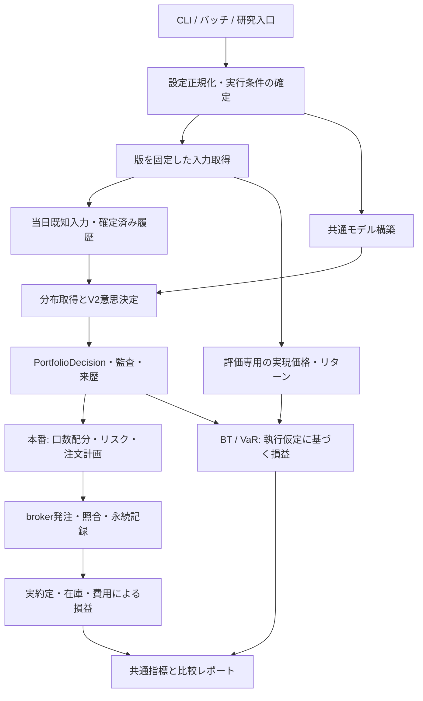

# バグ修正後の構造改善・詳細計画

2026-09-22 / S0–S8実装確認・追加修正 / 全体は部分完了

最新の残件対応は[本番artifact・実運用受入](../20260922_production_acceptance/report.md)を参照する。P2の期限回帰に加え、明示9:10価格のBT・学習・gap生成への反映、欠損時の寄付代替を修正した。通常設定での口座読み取りとscheduler登録確認も実施した。以下の段階別表は過去時点の記録であり、最新の証拠・残件は同受入報告を正本とする。

9:10欠損時の寄付代替は仕様である。「全日付に実9:10観測が必須」という過去の運用残件は、固定したraw観測・正の日次寄付・使用価格出所の記録へ訂正する。providerの実available_atや監査失敗の扱いは緩和しない。

## 最新の完了判定（2026-09-21、再確認）

### 2026-09-21 実装追補

R1/R2のgap生成時点契約、run-owned観測時刻、R4のread-only account snapshot、R5の学習入力固定を実装した。全テスト・静的検査は通過している。実口座・Hosted CI・本番artifact昇格は外部受入条件として残るため、下表の全体判定は変更しない。

**S0–S8全体の完了は確認できない。** 各節の過去の「PASS」はその実施時点のサブ範囲を示す。
最新のコード・検証結果・残件は[2026-09-20実施結果](../20260920_structural_completion/report.md)と
[実装確認と修正報告](../20260917_structural_completion_review/report.md)を正本とする。

| 段階 | 今回確認・修正した範囲 | 全体完了までの残件 |
|---|---|---|
| S0 | 修正前作業ツリーのソース版・hash固定、全テスト、別ソース版によるh=1/3/5とsingle/MHの数値比較 | 原S0時点の全有効機能・全入口の比較証拠は未充足 |
| S1 | 共通factory・typed configを確認。VaRは継承解決済み設定を一度だけ取得し、同じ設定をkeyとBTへ渡す | 本番ML・外部入力を揃えた4入口の数値比較 |
| S2 | 入力mutation/JST/日付不一致を修正。EvaluationInputsを予測契約から除外。RunnerInputs、cache shim、target互換entryを撤去。`HistoricalInputs.calculation_frame(as_of)`でcurrent/future targetを遮断し、h=1/3/5回帰と明示`label_available_at`回帰を追加。 | horizon別ラベル終了時刻の全target列適用、既存全入口のcutoff検証、macro/ADR/観測時刻の実データ充填 |
| S3 | 公開分布APIを共通policyへ移行。可変gap path・旧resolver・別構築wrapperを撤去。旧h=3/5 manifest修正、VaR snapshot/worker分割・PIT履歴固定。typed pathへ09:10/macro/ADR/PIT入力欄を追加し、暗黙再取得を禁止。rank-reversal欠損時のstrict skipとPIT診断cacheの内容identityを追加。 | gap生成全入口の入力snapshot、Step 1とon-demandの実データ差分の説明 |
| S4 | 属性専用decision、注文計画、poll、報告契約を確認。照合失敗を最終CLI結果へ反映 | ローカルの受入範囲は完了 |
| S5 | 完了前の建玉/約定/記録確認、未解決runの停止、読取専用復旧入口・15:40ジョブ接続、子プロセス停止・batch排他を修正 | 実scheduler登録状態と実brokerの復旧証跡 |
| S6 | 共通PnL/Fill、分割注文とintent対応、約定価格・費用の永続化を確認・修正 | 実口座の建玉・費用・残高との差分突合 |
| S7 | 学習分離を確認。研究overlayが現行BTで無効になる経路を修正。wheel隔離import・versioned synthetic artifact推論を検証 | verified本番artifactの再生成と同じ入力での本番/BT weights照合 |
| S8 | CI定義・静的検査・依存境界・wheel実ビルド/インストール検証を整備。今回の全`tests/`は808件PASS。文書の完了表記を訂正 | hosted CIの実行結果、上記各段階の残件 |

外部証拠が必要な残件だけでなく、S2には未実装の境界が残っている。テストPASSや型の存在を、
全入力のオフライン再生・完全PIT・本番昇格可の証拠にはしない。

最終ローカル検証（今回修正後）: **全808テストPASS**（今回のserial実行17 warnings）。既存xdist証跡は追加回帰前の798件・16 warningsであり、
対象Ruff・mypy・import契約7件・compileall・
lock・文書リンク・wheelビルド/隔離実行PASS。固定入力8ケースの変更前後の数値は厳密一致した。

## 1. 結論と最初に進める範囲

**最優先は、本番・バックテスト・gap生成・VaRが、同じ版の設定と入力を使い、同じ計算部分を呼ぶ構造にすること。** 既に導入されている`ProductionRunner`、`PITDataLake`、`PortfolioDecision`、`FallbackPolicy`、`CacheManager`を起点に進める。

最初の実装単位は**S0「比較基準の固定」→ S1「設定入口とモデル構築の統一」**とする。次にS2で入力とI/Oを分け、S3で分布取得を整理する。この順序なら、修正済みの挙動を保ちながら、経路間の違いを一つずつ説明できる。

**各段階は、呼出元の移行と不要な旧経路の撤去までを完了範囲とする。** 互換wrapperを追加して新経路を動かしただけでは「移行中」である。撤去対象と期限、正規の公開境界として残すものを13章に定める。

注文の永続台帳、再起動後の復旧、実約定損益の統合は段階ごとに扱う。これらは運用挙動や保存契約も追加するため、関数分割と同じ変更には含めない。S5では永続台帳・復旧・排他・batch deadlineを実装し、S6では実約定損益の共通Fill/在庫接続まで実装した。実口座突合は運用確認として残す。

- 設計理由の正本: [構造改善のADR案](../../docs/decisions/2026-09-15-structural-improvement-boundaries.md)
- 出発点: [元監査](../20260912_workspace_audit/report.md)、[初回修正報告](../20260912_workspace_audit/fix_report.md)、[第8回レビュー](../20260915_stage_abc_round8_review/review.md)
- 現行実装の確認記録: [ソースhash・関数規模・解決済み設定](inventory.json)

### 修正完了との関係

第8回レビューは新規指摘なし、修正の受入条件PASS、全`tests/` **650 passed**と記録している。今回のS1a/S1b実装後にも、分割テストを外側タイムアウト付きで再実行し、全shardがPASSした。レビュー時とテスト分割・収録範囲が異なるため、件数は実行記録のshard別結果を正本とする。

同レビューが残した「provenance付き本番ML artifactの再生成」「同一artifact・同一入力での本番/BT weights照合」は引き継ぐ。構造改善のローカル実装は進められるが、この残件を完了するまではML有効の本番再現性を完了扱いにしない。旧artifactの拒否を緩めたり、MLを無効にした比較だけを本番相当と呼んだりしない。

本計画はHEAD `cf97bfaf4577a20c95ce931afd10ac72a6f08285`上の**修正済み作業ツリー**を読んだ結果である。HEADだけを「修正後baseline」としてcheckoutすると、未commitの修正を失う。以後の段階実装時も、作業ツリー全体の必要ファイルを別版として固定する。

## 2. 計画策定時（2026-09-15）の構造と再利用するもの

| 領域 | 現行コードから確認した状態 | 次に扱う構造上の課題 |
|---|---|---|
| 設定 | `execution/config.py`が継承解決とAppConfig構築を担当。ファイル合成は`config/loader.py`へ抽出済み | 明示したアプリ設定境界を保ち、下流の再解釈を減らす |
| モデル構築 | 本番は`ProductionRunner`、BTは`_generate_v2_weights`、gap生成はscript内で構築 | 同じBLPX/V2/MLの組立規則を共通化する |
| 時点付き入力 | 本番とBTの両方で`PITDataLake`を使用済み | `df_exec` propertyが内部の全履歴DataFrameを返す。snapshotのas_ofは現状、主に日付で扱われる |
| ドメイン型 | `PortfolioDecision`、`MarketSnapshot`などのfrozen dataclassを導入済み | 配列・dict・listは変更可能。`SignalPackage`は`MutableMapping`を実装する |
| 数理/I/O | `build_common_inputs`は純粋計算として分割済み | macro download、ML用ADR特徴量読込、9:10 target用cache読込が計算の呼出途中に残る |
| 分布取得 | `FallbackPolicy`、source別クラス、provenance共通validatorを導入済み | h=1・MH・`compute_distribution`の呼出契約、理由判定、再試行の責任をそろえる |
| cache | 入力内容・schemaのfingerprint、GapStore transaction、VaR snapshotを修正済み | 共通の入力版からキーを作り、読んだ版と計算した版の対応を追跡する |
| 注文 | `OrderRequest`/`OrderResult`、部分約定poll、失敗summary・照合を実装済み | pollと結果dictの集計が新規/決済で分散。再起動後の判断用の状態モデルを分ける |
| 損益 | BTの持越し在庫フローと初期wealthを含むDDを修正済み | weightベース評価、約定後の円建て実現PnL、費用見積りを別契約で接続する |
| ML・配布 | immutable version＋`CURRENT`を導入済み | 学習・推論・artifact I/Oが同じ1008行のmoduleにある。setuptoolsは`src`全体を探索 |

主な根拠: [runner](../../src/leadlag/runner/production.py)、[BT](../../src/leadlag/execution/backtester.py)、[PITDataLake](../../src/leadlag/data/pit_lake.py)、[ドメイン型](../../src/leadlag/domain/portfolio.py)、[SignalPackage](../../src/leadlag/domain/signal.py)、[分布source](../../src/leadlag/models/v2/distribution_source.py)、[ML overlay](../../src/leadlag/models/ml_order_overlay.py)、[配布設定](../../pyproject.toml)。型やsourceの存在を「境界の整理が全て終わった」証拠にはしない。

### 旧ロードマップから引き継がない前提

[ロードマップ](../../docs/refactor_roadmap.md)には過去時点の未了表と後年の完了欄が混在している。`[ ]`がないことも、ADRのacceptedも、実装完了の根拠には使わない。

- Phase 35のV2同期正本化は採用済み。Next-Genへの再統一は行わない。
- Phase 41/47/48の一部であるモデル分割、source chain、ドメイン型、cache managerは既存実装を拡張する。
- PITDataLakeは「Next-Genだけで使用」という旧前提から更新する。
- FallbackPolicyの標準順は**当日cache → 許可されたon-demand → flat**。旧文書の逆順を転記しない。
- `sample_df_exec`のyfinance依存や固定regressionの問題は修正済みとして扱う。
- `.npy`互換経路、BLPX shim、旧importの削除を、Phase番号だけを理由に先行させない。

## 3. 目指す責務とデータの流れ

`runner/`は依存部品を組み立てる層、`models/`は予測・意思決定、`core/`は純粋計算、`data/`は入出力adapter、`domain/`は境界の型、`execution/`は口座・注文・運用の制御を担当する。`reporting/`は結果から表示物を作る。研究は本番計算を呼べるが、本番からresearchをimportしない。

日次decisionとgap生成が共通化するのは、設定と分布を計算する部品である。gap生成のために注文用Runnerを丸ごと起動したり、不要なML artifactをロードしたりしない。

## 4. S0 — 修正済みbaselineと比較基準を固定する

**目的:** 各変更が挙動を保ったことを、同じ修正済みコード版から比較できるようにする。

**実行状況 (2026-09-15): PASS。** [S0実行記録](s0_execution.md)、[baseline manifest](s0_baseline_manifest.json)、[機能基準マトリクス](s0_feature_matrix.md)に、S0時点の全650テストと構文・静的検査の結果を保存した。

1. tracked差分と必要なuntrackedソース・固定fixtureを含め、別ディレクトリまたはローカル比較版へ固定する。HEAD、対象ファイルhash、dirty差分hash、依存lock hashを記録する。秘密情報や運用データ全体を複製対象へ混ぜない。
2. 比較入力を固定する。df_exec、9:10価格、macro、ADR特徴量、PIT IR履歴、Step 1共分散、h=1/3/5 bundle、overlay artifact、全CLI上書きを含む。確認用コピーは運用storeから分離する。
3. 既存650テストと固定regressionを出発点にし、不足する**実経路同士の比較**を追加する。本番RunnerとBTでモデルをmockに置き換えたテストだけではweights一致を証明しない。
4. 監査時の再現probeを全てもう一組コピーする方式は避け、移行対象の契約で足りないケースを既存testsへ整理する。
5. 移行対象ごとに旧入口・正本・利用者・撤去段階を一覧化する。静的importだけでなく、動的import、monkeypatch先、CLI/batch/scheduler、pickle内のclass参照、対応する研究スクリプトも確認する。過去文書の言及と実行時依存を区別する。

**受入条件:** 比較版と作業版で数値・分岐の差を取得できる。ML有効の一時versioned fixtureと、実artifact再生成後の本番相当比較を区別する。現在の実artifactが拒否される挙動も維持する。

**成果物:** 比較manifest、固定入力の参照、機能別の比較表、実行ログ。実装時の保存先は`reports/<対象変更>/`。

## 5. S1 — 設定入口とモデル構築を統一する

### 5.1 設定の境界

対象: [execution/config.py](../../src/leadlag/execution/config.py)、[schemas.py](../../src/leadlag/config/schemas.py)、[ProductionRunner](../../src/leadlag/runner/production.py)、[BT](../../src/leadlag/execution/backtester.py)、[gap生成](../../tools/research/compute_gap_adjusted_distribution.py)、[VaR](../../src/leadlag/execution/var_history.py)。

- YAMLファイル合成は`config/loader.py`、alias変換とAppConfig構築は明示した`execution.config`のアプリ設定境界が担当する。下流からprivate合成関数を呼ばない。現行のアプリ設定loaderはbroker/envを含む正規の構築入口として維持し、別のloader wrapperを増やさない。`config/compat.py`を作る場合も、実際にサポートする外部設定形式の変換だけに限定する。
- 現在の環境変数・CLI・YAMLの優先順位を項目別にテストで固定してから移す。一律の優先順位を新たに仮定しない。strictの既定値や旧キーの拒否条件を変える場合は別変更とする。
- 内部で再度dict化してaliasを解釈する経路を撤去する。`ProductionV2RunConfig`、`CostConfig`、`RiskConfig`を用途別に渡す。`StrategyConfig`を経由する配分/リスク/費用の移行はS4・S6で閉じ、同一パラメータの二重正本と再変換を残さない。用途の異なる設定型を数だけの理由で一つに統合しない。
- `ResolvedRunSpec`を追加する場合は、既存パラメータの再定義をせず、採用した設定・上書き・artifact参照を束ねる。認証情報は保存対象から分ける。
- 比較用の`model_config_hash`と、費用・実行条件も含む`run_config_hash`を区別する。JSONのキー順・日付・数値表現を固定したdigestを使う。プロセス内のPython `hash()`を永続manifestの識別子へ転用しない。

解決済み本番値は、MH=1/3/5、ML有効、片道slippage=5bps、long/short carry=0.75/0.5、side leverage=1.5、実効gross上限=3.0。詳細はinventoryを参照する。費用のbps/小数、年率/日率を二重変換しない。

### 5.2 S1a実行結果（2026-09-15）

[S1a実行記録](s1a_execution.md)のとおり、YAML loaderの抽出と対象テスト・回帰を完了した。S1aはPASS。S1a時点の`execution.config`互換aliasはS1dで撤去済みである。S1a/S1bの統合判定は[実施報告](s1a_s1b_completion.md)に記録する。

### 5.3 共通factoryと実行単位

- `runner/model_factory.py`を設け、`build_blpx`、`build_decision_model`相当の小さい関数で構築を共通化する。CLIやbrokerの依存を持ち込まない。
- 本番→BT→VaR→gap生成の順に呼出元を切り替える。BTの公開引数と明示overlay overrideを保持する。
- overlayは実行またはfoldの開始時に一度選択・検証する。VaRへ既に渡している同一objectを保ち、途中の`CURRENT`変更で取り替えない。
- BTのworker間で可変モデル・cacheを共有しない。日付ごとのcold生成に強制することも避け、独立worker内で再利用できる所有関係にする。
- gap生成が必要とするBLPX部分だけを構築し、horizon別の入力と設定を明示する。

**受入条件:** 4入口の共通モデル設定と、各入口が必要とする有効機能・選択artifactが一致する。費用や実行上書きによる意図した差はmanifestに出る。本番/BTのweights、gap生成のμ・Ω、VaRの履歴系列と、各経路の例外/flat化は変更前と同じ。`test_runner_config`、`test_config_validation`、ML・VaR関連回帰を維持する。

### 5.3.1 S1a/S1b 実施結果（2026-09-15）

S1aは完了と判定する。`config/loader.py`がYAMLの`__base__`解決、deep merge、相対パス解決、循環参照検出を担当する。deep mergeの入力不変性、相対継承、循環参照、抽出loaderと既存loaderの同値をテストで確認した。S1a時点の一時aliasはS1dで撤去済みであり、S1a完了は旧入口を恒久的に残す意味ではない。

S1bは完了と判定する。`runner/model_factory.py::build_v2_model_bundle`が、解決済み`AppConfig`から同じ`ProductionBLPXModel`、`ProductionV2Model`、overlay objectを構築する。`ProductionRunner`と`BacktestEngine`はこのfactoryを呼び、BacktestEngineの明示overlay指定と並列workerのcache初期化をfactoryへ渡す。raw dictはfactory境界で拒否し、設定の再解釈を行わない。

S1b単体の完了範囲は本番RunnerとBTの構築統一である。後続のS1cでgap生成の構築切替を完了したが、VaRの期限付き準備を含む切替は未実施。現行ML artifactがlegacy形式で拒否される挙動も維持しているため、provenance付きartifact再生成と本番/BT weights照合の残件は解消していない。

### 5.3.2 S1c 実施結果（2026-09-15）

[S1c実行記録](s1c_execution.md)のとおり、gap生成のh=1/h=3/h=5のBLPX構築を`runner.model_factory.build_blpx_model`へ切り替えた。gap生成はML overlayを使わないため、V2 bundle全体ではなくBLPX単体factoryを選ぶ。Step 1共分散の読込・gap補正・診断・保存の計算経路は変更していない。`run_config.json`へ有効V2設定とSHA-256を記録する。

S1cは、**設定からBLPXを構築する境界の統一**としてPASSとする。Step 1共分散経路とV2 on-demandのμ/Ω同値性は未検証であり、S3bで分解比較する。VaRの期限付き準備はS1cの範囲外として残す。

### 5.4 S1d — 設定・構築の旧経路を撤去する

本番・BT・gap・VaR、対応するtools/scripts/research、testsのprivate合成loader importと呼出先を正本へ切り替える。旧moduleから設定型を再exportしている参照は、用途ごとに`config.schemas`または正規アプリ設定loaderへ直接向ける。Runner内の旧ML設定を`hasattr`で順に探す分岐と、入口ごとの重複factoryを削除する。入力形式の互換処理が必要なら入口で一度だけ行う。broker/envを含む`load_config_from_yaml`は、実行設定を構築する正規アプリ境界として残す。

S1dでは変更前後の意味を検証した上で、private旧APIの廃止を完了とする。broker/envを含む正規アプリ設定loaderは公開境界として責務を持つため、利用者を移すためだけの別wrapperは作らない。外部利用者が具体的に確認された場合は、その利用者・対応するversion・移行手順・撤去段階を記録する。外部利用者がいるかもしれないという推測だけで内部旧入口を残さない。

### 5.4.1 S1c / S1d 完了確認・実行結果（2026-09-15）

[S1c/S1d実行記録](s1c_s1d_execution.md)のとおり、S1cのgap生成factory切替と
effective設定記録を再確認し、S1dの撤去を実施した。`config.loader`をYAML合成の正本、
`config.schemas.parse_run_config`をV2 mapping正規化の正本、`execution.config.load_config_from_yaml`
をbroker/envを含むAppConfig構築の正規アプリ境界として固定した。

S1dで撤去したものは、`execution.config`内のprivate YAML合成alias、model側のparser中継、
下流の旧import、pipelineの重複BLPX factory、Runnerの旧`hasattr`設定探索である。対応する
monkeypatch先と単体テストも正本へ移した。`generate_v2_production_portfolio`のdict入力と
`data/cache.py` shimは、具体的な利用者と移行条件を持つS2/S3の撤去対象として残す。
`models/blpx.py`再exportは後続S8でpackage利用者と動的参照がないことを確認して撤去した。
これらをS1d完了と混同しない。

## 6. S2 — 入力版、PIT、I/Oの境界を明確にする

### 6.1 入力を三つに分ける

| 契約案 | 内容 | 読める側 |
|---|---|---|
| `KnownMarketInputs` | trade_date、JSTのas_of、実US signal session、ticker順、当日既知US/gap/価格、beta、macro/ADR特徴量、sourceと観測時刻 | 予測・配分 |
| `HistoricalInputs` | 過去の学習窓、horizon、各ラベルの確定日/時刻、2010–2014固定prior、過去のPIT IR履歴 | BLPX・PIT・ML推論用の過去統計 |
| `EvaluationInputs` | 当日以降のclose・実現target・評価用価格 | BT損益・事後レポートのみ |

`DecisionInputs`は最初の二つと版IDを束ねる。型は既存`MarketSnapshot`を移行元とし、同じ市場状態を別々に再計算する型を増やさない。

**h=3/5は行番号だけで学習可否を決めない。** 現行のラベル配置と終了日を確認し、予測時点までに確定したラベルだけを提供する。営業日対応も日米calendarの結果を使う。今日のUS/gapは既知でも、今日のJP targetは未知という区別を維持する。

### 6.2 取得を計算の前へ移す

- macro downloadを`core/macro.py`からdata providerへ移し、`core`には受け取った系列を計算する関数を残す。
- MLの`_load_adr_features`とtargetのintraday cache取得を入力adapterへ移す。
- **h=1の互換経路に注意する。** `compute_jp_target_returns`は`p_910_df=None`と明示指定で別実装を選ぶ。I/Oを外す際に一律`p_910_df`を渡して切り替えず、現在のh=1 target計算を同値に抽出してから統合する。
- Step 1共分散、rank reversal、PIT IR履歴、gap bundleの参照も入力版へ含める。df_execとoverlayだけのhashで再現可能としない。
- まず従来のcutoff・欠損処理をそのまま抽出する。available_atを厳密に検証する新しい規約は、入手可能な時刻情報を確認した別変更として入れる。
- 古いmacro/ADRデータに利用可能時刻の証拠がない場合は、日付による近似と不明点を記録する。今回の構造整理で過去の完全PITが証明されたとは扱わない。

### 6.2.1 S2a 実施結果（2026-09-15）

[S2a実行記録](s2a_execution.md)のとおり、取得処理を計算層から入力adapterへ移した。
`data/macro.py`がmacroのyfinance取得・timeout・列順正規化・cacheを担当し、
`core/macro.py`は受け取った系列のsurprise/kappa計算だけを担当する。ML overlayの
ADR pickle読込・鮮度判定は`data/adr_features.py`へ移し、modelはDataFrameまたは
`None`だけを受け取る。5分足cacheの読込と09:10 midpoint・寄り→09:10調整値の抽出は
`data/intraday_inputs.py`へ移した。

h=1は、従来の欠損・非正価格時のゼロ調整と、`(1+oc)/(1+open_to_910)-1`の式を
`preprocessor`の計算関数へ明示入力として渡す。既存の公開`preprocessor.compute_jp_target_returns`
は移行中の外部利用者向けにadapterを呼ぶcompatibility entryとして一時的に残すが、
本番Runner、BT、BLPX共通入力、ML overlay、gap生成、主要研究入口は`intraday_inputs`
を直接利用する。これはS2bで利用者を時点付き入力へ移し、撤去条件を満たした時点で削除する。

S2aはネットワーク接続時刻やADR artifactの完全なavailable_atを新規に仮定しない。
現行のdate/staleness fallbackを維持し、PIT入力版とread-only所有権はS2bの契約変更として扱う。

### 6.2.2 S2b 実施結果（2026-09-16）

[S2b実行記録](s2b_execution.md)のとおり、S2aで抽出した取得adapterを、版付きの入力契約へ接続した。
`domain.inputs`に`KnownMarketInputs`、`HistoricalInputs`、`EvaluationInputs`、`DecisionInputs`、
`InputVersion`を追加し、既知の市場状態・過去学習窓・事後評価値を別の型で保持する。
既知入力にはticker順、US/gap/価格/beta、macro/ADR特徴量欄、観測時刻、厳密に過去の`sig_date`を含め、
履歴入力にはhorizon、2010-01-01〜2014-12-31固定prior、ラベル確定情報、PIT IR履歴を含める。

`MarketSnapshot`は生成時に配列をコピーしてread-only化し、価格・終値をmapping proxyで保護する。
`PITMatrixView`も所有コピーをread-onlyで保持する。`PITDataLake.build_decision_inputs`が旧snapshotと
履歴を一度だけ契約へ組み立て、`ProductionRunner`、V2 decision、BacktestEngine、日次bridgeは
`DecisionInputs`をモデルへ渡す。バックテストは履歴契約を日付ごとにdeep copyせず、run所有の履歴を再利用する。
`InputVersion`はschema・既知入力・履歴・評価入力の内容SHA-256を束ね、同一入力の再現性を追跡できる。

旧`df_exec`/`lake`/`snapshot`/`current_prices`引数は、既存の外部利用者とテストを壊さないため入口adapterに
限定して残した。内部decision経路で複数候補を優先順位付きに読む処理は廃止し、S2bの完了条件を満たす
新経路へ切り替えた。`preprocessor.compute_jp_target_returns`互換entry、`data/cache.py` shim、
公開dict wrapperは具体的利用者の移行確認後にS2/S3で撤去するため、S2全体は未完了とする。`models/blpx.py`再exportはS8で撤去済みである。

**S2b判定:** 入力版付け・PIT入力分離・read-only所有権・主要4経路の切替はPASS。旧公開境界の撤去と
macro/ADRのavailable_at厳密化は、計画どおり後続段階に残す。

### 6.3 可変データの扱い

frozen dataclassだけでは内部配列は固定されない。境界で配列の所有権を分けてread-only化し、辞書・リストは再帰的に保護する。元入力・返却値・cache返却値を変更して他のrunへ影響しないことを検証する。S2の移行中にDataFrameを返す互換APIが必要ならコピーを返し、S2完了時に内部利用者を時点付き入力へ切り替えて旧経路を撤去する。

履歴全体を毎日deep copyする方式を既定にしない。一度固定したdatasetと、必要な過去窓のviewを組み合わせる。read-only配列とラベル可視範囲は別の制約として検査する。joblibへのシリアライズとworkerの所有関係も確認する。

**受入条件:** 固定した入力を取得後に元cacheを訂正しても当該runは変わらない。入力版を変えた次runは更新を認識する。純粋計算部分の実行中にnetwork/file取得が発生しない。未来target摂動h=1/3/5と入力mutationを検証し、2010–2014 priorを維持する。

## 7. S3 — 分布取得とcacheの契約を統一する

対象: `models/v2/{distribution_source,fallback_policy,gap_io,decision_engine,overlay_applier}.py`、`utils/{gap_matrix_io,distribution_provenance,dataframe_fingerprint}.py`、`data/gap_store.py`、gap生成script。

1. `DistributionResult`を`Ready / Unavailable / Rejected`など矛盾しない結果型へ段階移行する。μ・Ω・horizon・source・provenanceを一組にする。既存のdict形式や`flat_decision`の一時adapterが必要なら利用者の移行中だけ置き、S3完了時に撤去する。終端flatの挙動は新しい結果契約で維持する。
2. `FallbackPolicy`がsource選択と試行記録を担当する。validatorが同じ検証式の正本となり、境界側は検証済み結果を確認する。監査の再検査自体は削除しない。
3. エラー文字列の`"provenance"`や`"[FATAL]"`検索で理由を推定する箇所を、型付きreasonへ置き換える。現行fallback flags・診断・アラートの意味を保持する。
4. single/MH/公開`compute_distribution`でresolverを共有する。標準cache優先と、現行`use_file_cache=False`のon-demand優先・cache救済を別policyとして保持する。
5. 追加horizonの拒否、利用可能horizonの合成、全体flatの条件を現在の回帰で固定する。MHの一部欠損を一律に「全部flat」へ変更しない。
6. `GapBundleRef`に保存schema版、trade_date、horizon、入力版、model/config版、digestを持たせる。現在のSQLite transactionと`.npy` commit manifestを再利用する。識別情報を強制する切替は旧bundleとの移行仕様を決めてから行う。
7. VaRのsnapshot取得・fingerprint・worker所有権・cache保存deadlineを小さい部品へ抽出する。修正済みの「遅延結果を採用しない」「worker終了前に入力を消さない」条件を維持する。

### 7.1 S3a 実施結果（2026-09-16）

[S3a実行記録](s3a_execution.md)のとおり、分布取得の結果とfallback理由を型付き契約へ移した。
`domain.distribution`を正本とし、`DistributionStatus`（ready / unavailable / rejected / flat）、
`DistributionReason`、`DistributionAttempt`、`DistributionResolutionError`を追加した。
従来の`is_available`、`is_flat`、`alerts`、`flat_decision`は外部互換のため残すが、内部の分岐は
status/reasonと試行トレースを使う。source境界でcache・on-demandの例外や来歴不正を理由コードへ変換し、
`FallbackPolicy`は試行順・診断・監査失敗をそのトレースから決める。

single/MH経路では、分布が利用不能または来歴不正のときに`DistributionResolutionError`を渡し、
decision側が理由コードを使ってflat化と`fallback`を設定する。`"provenance"`や`"[FATAL]"`の
文字列検索による理由推定はfallback/decision経路から撤去した。raw alertの分類はI/O境界の
`distribution_source`に限定し、既存のログ・JSON互換を維持する。

S3aは**型付き結果・理由・試行記録の統一としてPASS**とする。`data/cache.py` shim、
公開dict wrapper、h=1/MH/公開APIのresolver重複、gap生成の責務分割と
bundle manifestは、利用者切替と数値同値性の確認を含むS2c/S3b/S3cで撤去・整理する。

### 7.2 S3b 実施結果（2026-09-16）

[S3a/S3b計算境界実施報告](../20260916_structural_improvement_s3a_s3b/report.md)、[S3b全体完了報告](../20260916_structural_improvement_s3b/report.md)

S3bは、gap生成とon-demandで共有できる**純粋な一日分の計算境界**と、研究診断CSVの出力境界を先に分離した。
`pipeline/gap_distribution.py::compute_gap_distribution`がraw μ/Ω、gap補正、分母floorを一つの不変な結果型で返し、
gap生成scriptのh=1/h=3/h=5がこの関数を呼ぶ。h=1はStep 1の`Omega_struct`を明示的に渡し、on-demandのBLPX共分散を
暗黙に流用しない。`pipeline/gap_reporting.py`はaccumulatorから6種類の安定した診断DataFrameを構築・保存する。

S3bの計算・診断出力サブ範囲は、純粋計算の入力不変性、分母floor、Step 1共分散の明示性、stable CSV名をテストで固定し、
**PASS**とする。S3aの型付きsource契約、S1cのmodel factory、既存のbundle保存・provenance・監査は維持している。

研究固有のplot生成、入力取得の組立、portfolio評価・report.md生成は、次の完了単位でresearch diagnosticsへ分離する。

### 7.2.1 S3b 全体完了（2026-09-16）

`research/diagnostics/gap_inputs.py` が raw/preprocessed market data、TOPIX trade return、
Tachibana realtime、h=1 と h=3/h=5 の共通入力を組み立て、
`gap_portfolio.py` が実現リターン・slippage・raw/gap IR・エクスポージャーを評価する。
`gap_outputs.py` は lookahead-free cost列、PIT bin比較、監査JSON、plot、reportを担当する。
研究入口は入力取得・一日計算・保存・診断frame・評価出力を各境界へ委譲し、
production の `leadlag.pipeline` から matplotlib/seaborn や research package を参照しない。
境界テスト29件を追加・再実行し、既存の gap 計算・CSV契約を含めて **S3b全体をPASS** と判定する。
全体テストは unit/integration/research/features/regression を合わせて 693 passed だった。

### 7.3 S3c 実施結果（2026-09-16）

[S3c実施報告](../20260916_structural_improvement_s3c/report.md)

S3b全体は、`gap_distribution`/`gap_reporting`の共有計算・CSV境界に加え、
research固有の入力取得・plot・portfolio評価・report生成を `research/diagnostics` へ移したことで完了した。

S3cでは、`domain/gap_bundle.py::GapBundleRef`を追加し、μ・Ω・metadata・trade date・horizon・storage format・
input/model/config version・ticker orderを一つのmanifestで識別できるようにした。NPY互換経路はmanifestをcommit marker
としてpayload digestを検証し、SQLite `GapStore.save_horizon` / `load_horizon_bundle`は行列・metadata・manifestを
同一transaction/snapshotで扱う。既存の三値loaderと旧format_version=1 manifestは移行期間の互換境界として残す。

`execution/var_cache.py`の`VaRCacheIdentity`は、effective config、`df_exec`、code、選択overlay、gap入力版を
既存のcache keyへ反映する。`DeadlineBudget`は履歴準備・copy・worker計算で共有するmonotonicの絶対期限を提供し、
`var_history.py`は期限切れ後の結果を採用しない。従来のdaemon workerとsnapshot keepaliveの限界を保ったまま部品を抽出した。

S3cのbundle/cache契約サブ範囲は、NPY/SQLiteのmanifest往復、SQLite一括保存、cache identityの差分、期限切れを
含む61件の対象テストでPASSした。全体テストと静的検査の結果は実施報告に記録する。
2026-09-18の確認では、snapshot/fingerprintを`execution.var_inputs`、workerの所有権・保存期限を
`execution.var_worker`へ分離した。PIT履歴CSVもsnapshotへ含める。旧NPY readerは13章の具体的な
利用者を持つ対応形式として維持し、h=3/5の旧manifestをdigest検証付きで修正した。
macro/ADR/09:10等の外部入力の完全固定と、実データでのcache/on-demand比較は引き続き残る。

### 7.3.1 追加修正（2026-09-20）

実経路の再検証で、h=1の研究生成がsignal dateに一致しない古いStep 1 `Omega_struct`をfallbackとして
使うと、file cacheとon-demandの共分散がずれることを確認した。該当日ファイルがある場合だけStep 1構造を
明示的に使い、古いfallbackは診断用に記録して出力には使わず、BLPX共分散へ戻す。これでh=1のcache/on-demand
経路は同じ共分散生成規則になる。

新規bundleのmetadata/manifestには `input_version`（09:10時点のas-of入力）、`model_version`、
`config_version`、`ticker_order`を必ず保存する。df_execを使うdecision側は同じ4項目を読み込み時に比較し、
不一致または欠落をcache不採用としてon-demand/fallbackへ送る。旧fixture向けの低レベルreader互換は残すが、
productionの入力付きcache経路では来歴なしbundleを受け入れない。

### gap生成とon-demandを共通化する前の条件

現在のgap生成h=1はStep 1の`Omega_struct`を読んで共分散を再構築する。一方、on-demandはBLPX結果から`build_raw_distribution`を呼ぶ。gap生成のMHには累積入力を作る経路もある。**factory共通化は、これらの計算同値性の証明にはならない。**

同じ日・horizonについて、prior、residualization、target、9:10価格、共分散の生成版、gap補正係数を比較し、raw μ/Ω → gap μ/Ω → scores → weightsの順に差を分解する。差があれば既存差として記録し、どの仕様を採用するかを別の修正・モデル変更として判断する。許容誤差を広げて吸収しない。

gap生成scriptから先に「入力取得」「一日の分布計算」「保存」「診断集計」「描画」を分ける。数値同値が確認できた部分から既存`core/gap_adjustment.py`と共通化する。診断CSVやplotsの都合を本番の分布関数へ持ち込まない。

**受入条件:** 訂正・列順変更・horizon切替・呼出順変更でcacheが混同されない。bundleの一部書込失敗・来歴不正・SQLite lockの回帰がPASS。cacheとon-demandの同値性は比較できた入力・horizonを明示して報告する。

## 8. S4 — 意思決定と執行の境界を型で接続する

対象: [v2_bridge.py](../../src/leadlag/execution/v2_bridge.py)、[post_decision.py](../../src/leadlag/execution/post_decision.py)、[broker_ops.py](../../src/leadlag/execution/broker_ops.py)、[close.py](../../src/leadlag/execution/close.py)、[pricing.py](../../src/leadlag/execution/pricing.py)、[core/types.py](../../src/leadlag/core/types.py)。

| 境界 | 持たせる内容 | 責務 |
|---|---|---|
| `PortfolioDecision` | 既存w_final、scores、分布、PIT、監査、fallback＋入力版ID | 予測とモデルポートフォリオ |
| `ExecutionPlan` | decision_id、配分口数、開始時の確認済み建玉、未約定注文、増加/削減の区別 | リスク制約を満たす注文差分の決定 |
| `OrderObservation` | broker注文ID、観測時刻、状態、累積約定数量、残数量、raw応答参照 | brokerの観測事実 |
| `ExecutionReport` | accepted/filled/partial/failed/pending、照合状況、残存建玉のsnapshot参照、記録失敗 | 実行結果の集計とCLIの終了判定 |

新しい型は既存`OrderRequest`、`OrderResult`、`Position`を再利用して組み立てる。broker固有フィールドを上位に流す必要がある場合はraw参照として保存し、通常の数量・価格・状態はadapterで正規化する。

- `run_v2_decision`を入力取得、計算、配分/リスク、執行呼出、保存に分ける。dictへの変換は既存JSON writerと互換CLIの境界に寄せる。
- 新規と決済のpollを共通部品へ抽出する。ただし注文目的別の待機期限と引け注文の意味を保持し、同じ短いtimeoutへ統一しない。
- 注文終端状態と照合完了を分ける。取消済みでも部分約定数量は残り、FILLEDでも約定詳細取得が失敗すれば照合未完了である。
- risk stop時の増加禁止と確認済み在庫の削減を現在の規則のまま保持する。反転は「削減が終わる前に新規を出す」経路へ戻さない。
- 約定・建玉・余力・journalは一つの収集失敗で後続を省略しない。元の発注失敗と後処理失敗を両方残す。

**受入条件:** 全拒否、片側成立、部分約定、取消後約定、照会失敗、初回ログ失敗で現在の終了コード・summary・削減規則を維持する。model weights、leverage適用後の目標、口数丸め後、実約定後のnet/grossを混同しない。

### 8.1 S4a/S4b 実施結果（2026-09-16）

S4aは、既存の`PortfolioDecision`をモデル側の型付き正本として維持したうえで、配分済みDataFrameと確認済み建玉から`ExecutionPlan`を構築し、発注関数へ明示的に渡す境界まで実装した。`OrderObservation`と`ExecutionReport`を追加し、brokerの観測事実、終端状態、照合・記録失敗をJSON writerの互換表現へ変換する。残存建玉の実測値は既存のposition snapshot/journalを参照し、S5で台帳へ接続する。DataFrame・dict・CSV/JSONは外側の互換境界として残し、内部の注文計画・実行報告の正本にはしない。

S4bは、新規注文と引け決済のstatus pollを`order_lifecycle.poll_order_statuses`へ統合した。OrderResultと引け処理dictの差はadapterへ閉じ込め、pending、probe、deadline、照会失敗、未解決状態の扱いを共通化した。既存の注文目的別timeoutと、返済完了前に新規を出さない規則は維持している。

対象回帰・追加テスト61件、全`tests/` 696件、Ruff、mypy、compileall、`git diff --check`がPASSした。S4a/S4bの範囲は完了と判定する。ただし、`PortfolioDecision`のdict互換撤去、永続注文台帳・再起動復旧・実行排他はそれぞれS4後半またはS5の残件であり、今回の完了には含めない。

### 8.2 S4後半 実施結果（2026-09-16）

`PortfolioDecision`から`__getitem__`、`get`、`keys`、`items`、`values`、`__iter__`、`__contains__`、`__len__`、`from_dict`、`to_dict`を撤去した。モデル、執行、backtest、研究overlay、fallback結果の利用者は属性参照へ移行し、overlay更新は`dataclasses.replace`で新しいimmutable値を返す。

legacy mappingを受けるのは`reporting/production_v2_writer.py::_coerce_decision`だけである。これはJSON/CSV/Markdown writerの入口に限定した互換adapterで、内部のモデル・執行経路へmappingを戻さない。回帰テストも`PortfolioDecision`の属性契約へ移し、writer境界のmapping変換を別テストで固定した。

S4後半は、対象回帰・追加テスト100件、全`tests/` 698件、Ruff、変更対象mypy、compileall、import-linter、`git diff --check`をPASSした。S4のdict互換撤去範囲は完了と判定する。永続注文台帳・再起動復旧・実行排他は引き続きS5の対象である。

## 9. S5 — ジョブと注文の永続状態を整備する

**分類: 運用挙動の追加。S4の関数抽出とは別の変更。** 詳細な保存schemaと復旧規則は、この段階で個別ADRにする。

### 9.1 永続台帳の最小構成

SQLiteなどの既存運用と整合するstoreへ、run、order intent、order observation、reconciliationを保存する。各注文の意図をbroker呼出前にcommitし、broker注文ID取得後に対応付ける。観測は追記し、現在状態は再構築できるようにする。全面的なイベント基盤は導入しない。

- run状態例: prepared / executing / reconciliation_required / completed / failed_before_submission。
- order状態とrun状態を同じenumに詰め込まない。約定累計と取消・拒否などの状態は別フィールドで保持する。
- タイムアウト、送信直後のprocess停止、応答保存失敗は「送信有無不明」と記録する。brokerで注文・約定・建玉を照合し、対応が確定するまで新規再送しない。
- broker側の重複排除機能が確認できない限り、exactly-once発注を保証すると記載しない。local keyは照合の手掛かりであり、brokerとの原子的transactionにはならない。
- 識別可能な約定IDで重複観測を排除する。照会APIが返す累積約定数量を毎回新しい約定数量として加算しない。

### 9.2 排他・期限・復旧

- `(口座, 戦略, 取引日, ジョブ種別)`を実行識別の基本とし、attemptは別IDにする。config変更だけで二重実行チェックをすり抜けない。
- decisionとcloseは同じ口座・戦略の建玉を変更するため、ジョブ種別別のlockだけで並走を許可しない。口座・戦略に対する執行の排他を設ける。
- まず単一ホストの現行同期運用を対象にする。複数サーバーで動かすなら排他の保存先・所有期限・旧worker停止保証を別途設計する。PIDや期限切れだけで再送を許可しない。
- monotonic deadlineを工程間で引き継ぎ、外側watchdogでprocess group全体を停止する。VaRの待機打切りとworker寿命の既存設計を損なわない。
- 引け注文は提出と引け後照合を分け、未約定を次の照合ジョブへ引き継ぐ。実際のscheduler登録・口座状況は切替時に確認する。

### 9.3 バッチ入口

[run_decision_v2.sh](../../scripts/batch/run_decision_v2.sh)には、設定のSQLiteを`--gap-dir .../latest`で上書きする経路と「gap失敗ならflat」という古い説明が残る。config正本へ合わせる切替をこの計画の運用項目として扱う。現在のsource選択を変えるので、単なるコメント整理とは分ける。

batchは引数とログを用意する薄い入口にし、共通job実行部品が期限・排他・状態記録を担当する。`run_decision_v2.sh`、`run_close_positions.sh`、`run_gap_distribution.sh`とplistとの対応を明示する。リポジトリのplistを読んだだけで、実schedulerへの適用済みとは判断しない。

**受入条件:** 送信前/直後/応答記録前/照合中にprocessを止めるテストで、再起動後に二重送信しない。記録不能なら送信前に停止する。記録後の送信有無不明は照合待ちとして残る。同一runの二重起動、closeとの競合、期限超過をテストする。本番への送信テストはローカル検証に含めない。

### 9.4 S5a/S5b 実施結果（2026-09-16）

[S5実施報告](../../reports/20260916_structural_improvement_s5/report.md)のとおり、
SQLiteのrun/order intent/order observation/reconciliation台帳、同一jobの再送拒否、
`live:production_v2` lease、process group deadline、引け後照合checkpointを実装した。
decisionとcloseのbatch入口は同じlease scopeを使い、`run_decision_v2.sh`をmacOSの正本入口に固定した。
旧`run_decision.sh`は撤去し、scheduler・手順書・Architectureの参照を更新した。
実schedulerの登録状態と実口座での照合は、運用環境で確認する別作業として残す。

## 10. S6 — 損益計算とレポートの責務を分ける

対象: [BT損益](../../src/leadlag/execution/backtester.py)、[費用見積り](../../src/leadlag/execution/cost_calculator.py)、[日次実現PnL](../../src/leadlag/reporting/daily_pnl_report.py)、[共通指標](../../src/leadlag/reporting/metrics.py)、[研究共通処理](../../src/research/backtest_common.py)。

### 第1段階: 現在の数値を保って抽出

`_simulate_daily_pnl`を`core/pnl.py`相当へ抽出し、入力在庫・当日売買・持越し・費用を明示する。BTは日付ループと結果組立、reportingは表示に集中する。別の`CostBreakdown`にbps・日次小数・円建ての異なる単位があるため、名前だけで統合せず単位を型とフィールドへ付ける。

現在の主指標のturnover定義、overnightの損益帰属日、終端の扱いを固定する。これらを実約定台帳に合わせて変更する場合は、第2段階の契約変更として差分を説明する。日次合計だけを合わせて銘柄・費用の差を隠さない。

### 第2段階: 実約定と評価仮定を接続

- `Fill`、`InventoryLot`、`FeeAccrual`などの共通語彙をS5の約定・建玉へ接続する。実運用は観測した約定、BTは明示した執行仮定からの約定を入力にする。
- 現行weightベースBTは保存した比較用のreferenceとして残す。最初から全期間を口数・板付きのevent simulationへ置換しない。
- 実約定価格を使うPnLには価格悪化が既に含まれる。slippageをbenchmarkとの差として報告する場合と、proxy価格のBTから費用として控除する場合を区別する。
- financing/borrow/reverseは暦日で扱い、未取得費用をゼロ確定値にしない。未取得・推定・確定を分ける。
- 実現/未実現、日中/夜間、売買費用/保有費用、入出金を分離する。口座残高の増減をそのまま戦略PnLにしない。
- `MetricsSpec`で評価営業日、年率化頻度、flat日の扱い、費用単位をそろえ、既存`reporting.metrics`を再利用する。

**受入条件:** 第1段階はdaily gross/net、各費用、turnover、DDが変更前と一致する。第2段階は小さい約定・在庫ケースの手計算と一致し、brokerの建玉・費用と残差を説明できる。実約定資料がない区間は評価仮定による結果として表示する。

### 10.1 S6a/S6b 実施結果（2026-09-16）

[S6実施報告](../20260916_structural_improvement_s6/report.md)

S6aでは、`BacktestEngine._simulate_daily_pnl` の数値ループを
`leadlag.core.pnl.simulate_daily_pnl`へ抽出し、BacktestEngineは日付整列と
Seriesの組立だけを担当するadapterにした。`alpha_masks`と暦日間隔を明示入力にできるため、
研究の選択的持越しも同じ費用計算を使う。抽出前後のgross/net、overnight、各費用、turnover、
open-to-close補助列は固定fixtureで一致を確認した。

S6bでは`Fill`、`InventoryLot`、`FeeAccrual`、FIFO partial close/reversal、entry/exit fee配賦、
mark-to-marketを共通会計プリミティブにした。引け実行ログの確認済みfill価格をそのまま入力し、
BTのslippageを二重控除しない。`daily_pnl_report`はこの台帳を通して実現/未実現を分け、
価格不足時だけ旧snapshotの明示的totalへフォールバックする。bps、decimal return、円建てfeeの
単位ラベルと`MetricsSpec`を追加し、BacktestResultStoreにはovernight帰属列を保存する。S5の
`order_observations`はschema v2へ移行し、fill価格・fee・fill ID/sourceを保存して
`list_observed_fills`から共通`Fill`へ戻せるようにした。累積pollは注文単位で最新化し、PnLの
二重計上を防ぐ。観測feeが欠落した行はゼロ費用として確定せず、台帳への変換を保留する。

S6a/S6bは対象回帰44件、全`tests/` 715件（17 warnings）、FIFO手計算、実約定価格のslippage
非二重計上、MetricsSpec、SQLite往復を確認したためPASSとする。実ブローカーの追加取得・実口座残高との突合、実scheduler登録は
このローカル構造変更の受入範囲外として別運用確認に残す。

## 11. S7 — ML学習・研究入口・配布を分ける

- `ml_order_overlay.py`を特徴量計算、推論、artifact検証/I/O、学習へ責務分割する。学習は`src/research/`配下へ、推論で使う特徴量順序・型・推論コードは本番へ残す。
- **pickle互換を先に確保する。** 保存済み`MLOrderOverlayModel`のmodule/class参照を変えると読込が壊れる。まずclass自体を元moduleの正本として残して周辺の学習・I/Oを分割し、class移動と再exportを機械的に増やさない。classを移す必要がある場合は対応artifact版の移行と旧参照の撤去工程をS7内に定め、versioned fixtureでload→predictの一致を確認する。legacy root artifactの拒否は維持する。
- LightGBMは学習だけでなく現行artifactの推論でも必要になる。production extraから除外しない。推論に必要な依存とartifact metadataのバージョンを配布manifestで確認する。
- `tools/production/train_ml_order_overlay.py`は既存運用入口を保ち、研究学習関数を呼ぶ薄いwrapperにする。学習環境と日次実行環境の依存を分ける。
- setuptoolsの探索対象を`leadlag`へ限定する案とし、researchは別の配布定義または明示した研究環境で使えるようにする。wheelから除外するだけで研究CLI・学習スクリプトを壊さない。
- `ExperimentRegistry`と`record_backtest_experiment`を再利用し、現行V2の実験driverへ設定・入力版・試行状態・指標の自動記録を寄せる。legacy実験や過去の全scriptを一括改変せず、新規・現行経路から移す。
- 構造の同値性テストをα探索の試行回数へ混ぜない。性能を比較して選択した実験は別途registry・DSR・OOSの規約に従う。

**受入条件:** 本番wheelにresearch packageが入らない。本番CLIとML有効の固定推論が研究packageなしで動く。研究環境では学習・現行V2実験入口が動き、成否・中断が記録される。wheel内容と、リポジトリ外の隔離環境からのimport/CLIを検証する。

### 11.1 S7a/S7b 実施結果（2026-09-17）

[S7実施報告](../20260917_structural_improvement_s7/report.md)

S7a/S7bを実装し、次の責務を分離した。

- `ml_overlay_features.py`へ特徴量計算、履歴20日volatility、p_trade推論前処理、V2配分再計算を移した。
- `ml_overlay_artifact.py`へprovenance検証、immutable version、digest、`CURRENT`切替、legacy root拒否を移した。
- `ml_overlay_inference.py`へ本番overlay適用とV2 wrapperを移した。LightGBM fitと学習データ収集は`research.experiments.ml_overlay_training`へ移した。
- `MLOrderOverlayModel`は元moduleに残し、pickleの完全修飾class pathを維持した。旧importはこのclassと分割先の薄いcompatibility exportだけを提供し、旧学習関数名はresearch移行案内のfail-closed stubとした。`tools/production/train_ml_order_overlay.py`は研究入口を呼ぶwrapperになった。
- setuptoolsのpackage discoveryを`leadlag*`へ限定し、`research` extraと[研究環境手順](../../docs/RESEARCH_ENV.md)を追加した。production import時に`research`を読み込まないことをsubprocessで確認した。

検証は、ML/factory/Stage ABC回帰52件とS7境界7件の計59件、compileall、変更対象のRuff、mypy、import-linter（4 contracts kept / 0 broken）をPASSした。既存のartifact保存・読込・digest・provenance回帰も同じ実行でPASSした。最終状態の全体テストは722件（18 warnings）をPASSした。setuptoolsの`find_packages(where="src", include=["leadlag*"])`は20 production packagesを返し、`research`は0件だった。wheelの実ビルドは、環境に`wheel`がなく、ネットワークも制限されてbuild依存を取得できなかったため未実行である。この制約を隠してwheel PASSとは扱わず、package discovery設定と隔離import検査を代替確認として記録する。

実artifactの再生成、同一artifact・同一入力での本番/BT weights照合、研究driverの実データ学習・ExperimentRegistryへの性能試行記録は、データと運用入力を必要とする残件であり、S7のコード境界実装とは分けて保留する。S7完了は配布・import・pickle境界までで、ML有効本番再現性の完了を意味しない。

## 12. S8 — CI・依存関係・文書を各段階へ組み込む

CIの最低限はS0から整備し、機能追加に合わせて強める。S8で`.github/workflows/ci.yml`を追加し、lock・静的検査・wheel・全体回帰を正本workflowへ統合した。

- lockとPython 3.12の既存環境を使う。`tests/`全体にunit/integration/research/regression/featuresを含め、分割scriptだけで全体PASSとしない。
- `compileall src/leadlag tests tools scripts src/research`、Ruff、mypy、import-linterを実行する。研究全域の既存lint負債と今回の新規エラーを区別し、既存負債の免除を無制限に広げない。
- source境界が移行できた段階で、`leadlag → research`禁止、純粋計算からI/O adapterへの依存禁止、domainへの上位依存禁止をimport契約へ追加する。import検査だけでは動的I/Oを防げないため、純粋計算の無I/Oテストも使う。
- 独立した比較対象のコード版・input manifest・数値diffをCI成果物として残す。実ネットワークや個人の`var/live`を必須fixtureにしない。
- `ARCHITECTURE.md`とscheduler手順は現行仕様、ADRは判断理由、roadmapは未了と受入条件、historyは過去経緯に分ける。実装済みコードを再実装させる古い記述を更新する。

### 12.1 S8 実施結果（2026-09-17）

[S8実施報告](../../reports/20260917_structural_improvement_s8/report.md)

S8を実装し、`.github/workflows/ci.yml`へPython 3.12・`uv.lock`固定のCIゲートを追加した。
`compileall`、production/maintained-tool Ruff、保守対象の研究学習入口Ruff、mypy、import-linter、
文書相対リンク、production wheelからの`research`除外、`tests/`全体を同一workflowで検査する。
wheel内容は`scripts/ci/verify_wheel.py`、文書参照は`scripts/ci/validate_docs.py`を正本とする。
Ruffのtargetは実行環境と同じ`py312`へ揃え、timeout utilityの型注釈も対応させた。

import-linterは既存4契約を維持し、production→research、純粋計算→I/O adapter、domain→application
configの3契約を追加した。7契約すべてがKEPT、mypyは141ファイルでエラー0、lock check・compileall・
Ruff・文書リンク77件もローカルでPASSした。ローカル環境ではwheel build依存を取得できないため実wheelの
生成だけはCIへ委譲し、workflow上でbuild・内容検査・artifact uploadを行う。

最終の実装漏れ確認では、重複していた`src/leadlag/models/blpx.py`を、package利用者・動的load・
配布参照がないことを`rg`とpackage importで確認して撤去した。`data/cache.py` shim、旧`df_exec`等の
入口adapter、`generate_v2_production_portfolio` wrapper、VaR lifecycle、旧dict/設定互換は、具体的な
利用者切替または運用証拠が必要なS2c/S3c後続残件として維持し、無期限の「念のため」ではなく対象と
撤去条件を表に残した。S8完了は構造改善全体や本番ML再現性の完了を意味しない。

**2026-09-18追記:** wheelの実ビルド・隔離installationからのCLI/合成artifact推論までローカルで
検証した。`data/cache.py`、`RunnerInputs`、target中継、旧resolver、別構築wrapperは利用者を移して
撤去済み。VaRのsnapshot/worker分割も実装済みである。現在の残件は冒頭表と最新報告のR1〜R6を参照する。

## 13. 変更の順序とレビュー単位

R = 現行挙動を保つ抽出・共通化、C = 入出力/保存契約の変更、O = 運用挙動の追加。

| 段階 | 最小のレビュー単位案 | 分類 | 依存 | 規模・主な難所 |
|---|---|---|---|---|
| S0 | baseline固定・比較入力・必須check | 検証/文書 | なし | 中。ML有効ケースと外部入力固定 |
| S1a | 設定loader/compatの抽出 | R | S0 | 中。aliasとoverride優先順位 |
| S1b | 本番/BT共通factory、VaRの選択object維持 | R | S1a | 中。worker、ML artifact |
| S1c | gap構築のfactory利用・effective設定記録 | R | S1b | 中。horizon別入力 |
| S1d | 旧設定入口・Runner互換分岐・重複factoryの撤去 | C | S1c | 中。研究/tools/testsを含む呼出元切替 |
| S2a | macro/ADR/9:10 I/O抽出 | R | S1 | 大。h=1互換と欠損処理 |
| S2b | 版付き入力・read-only化・PIT入力分離 | C | S2a | 大。ラベル確定と既存API移行 |
| S3a | 型付き分布結果・resolver/reasonの統一 | R/Cを分割 | S2 | 大。single/MH/互換経路 |
| S3b | gap script責務分割（入力・計算・保存・portfolio・診断出力）、同値部分の共通化 | R | S3a | 大。Step 1共分散との関係 |
| S3c | bundle/cache manifestとVaR部品の整理 | R/Cを分割 | S2 | 中〜大。保存schemaとdeadline |
| S4a | 決定→配分→注文の型付き境界 | R/Cを分割 | S1、S0の執行fixture | 中。旧dict出力互換 |
| S4b | poll/照合/summaryの共通化 | R | S4a | 中。新規/決済の差 |
| S5a | 永続台帳、復旧、実行排他 | O | S4 | 大。送信有無不明と再起動 |
| S5b | batch正本化、deadline、引け後照合 | O | S5a、S3の入力参照 | 中〜大。実scheduler切替 |
| S6a | 現行BTの純粋損益関数抽出 | R | S0、S1 | 中。費用・帰属日・終端 |
| S6b | 実約定/在庫/費用の台帳接続 | C/O | S5、S6a | 大。照合可能な実測データ |
| S7a | ML学習分離・artifact互換 | R/Cを分割 | S2 | 中〜大。pickleと特徴量契約 |
| S7b | 配布分離・現行研究driver | C | S7a、S1 | 中。依存と実験記録 |
| S8 | CI・文書・import契約 | 検証/文書 | 各段階 | 継続。各PRの完了条件に含める |

推奨の変更列**S0 → S1a → S1b → S1c → S1d → S2a → S2b → S3a → S3b → S3c bundle/cache境界 → S4a → S4b → S4後半**まで、各段階の範囲を実行した。
S2bは入力契約・PIT分離、S3aは分布結果・fallback理由の型付き化、S3bはgap計算・入力・portfolio・診断出力の分離までをPASSとした。
S3c bundle/cache境界はmanifest・cache identity・期限部品までをPASSとした。S4a/S4bは型付き注文計画・実行報告とpoll共通化、S4後半は`PortfolioDecision`の内部dict互換撤去までをPASSとした。S5a/S5bの旧完了報告には、照合前のcompleted、復旧入口・期限処理の不足があり、今回修正した。S6a/S6bでは損益計算と実約定Fill、S7a/S7bではMLの学習/推論分離とpackage discoveryを確認した。2026-09-18に旧entry撤去、VaR lifecycle分割、研究overlay接続、wheel実検証まで進めたが、残件は冒頭表のとおりであり、全段階完了とは判定しない。

表はレビュー境界の案であり、一つのPRに複数の契約変更を詰め込む目標ではない。特にS2/S3/S5は受入条件ごとにさらに分ける。工期はbaseline比較の実行時間と経路間の差の数をS0で測ってから見積もる。

### 不要な経路の撤去と、正規の境界として残すもの

薄い関数や再exportの存在だけではスパゲッティとは判定しない。追跡を難しくするのは、旧→新→別の互換入口という中継の連鎖、同じ値の再変換、複数の正本、呼出順に依存する共有状態である。正規の公開APIやbroker adapterは、その責務とサポート対象を明示する。

| 対象 | 最終形・撤去するもの | 閉じる段階 |
|---|---|---|
| 設定のprivate旧import・Runner旧ML分岐 | `config.loader`でファイル合成、`execution.config.load_config_from_yaml`でAppConfig構築、`config.schemas.parse_run_config`でV2 mappingを正規化し、private alias・model側parser中継・下流の旧形式探索を撤去 | S1d |
| `data/cache.py`互換shim | `decision_cache` / `market_data_cache`へ利用者とpatch先を移し、旧moduleを撤去 | 2026-09-18撤去済み |
| `df_exec`・lake・snapshot・current_pricesの多重入力 | 内部は`DecisionInputs`へ統一し公開入口で一度だけ変換。typed decisionは`calculation_frame(as_of)`でcurrent/future targetを遮断し、旧compatibility経路とhorizon別終了時刻が残る | S2部分完了 |
| macroの取得・暗黙の`_current_gap_input_dir` | 一時path属性は撤去しbundle参照を明示。macro/ADR/09:10/PITのrun-owned欄とstrict pathを追加。旧compatibility・rank-reversal・観測時刻充填は未完了 | S2〜S3部分完了 |
| h=1/MH/公開分布APIの重複resolver | 一つのresolverを直接呼び、旧再試行loop・文字列による理由推定を撤去。必要なhorizon別処理は維持 | S3完了時 |
| `generate_v2_production_portfolio`の別構築経路 | 利用者を正本の構築/計算APIへ移し、wrapperを撤去。学習・診断で必要なML無効条件は明示して維持 | 2026-09-18撤去済み |
| `PortfolioDecision`のdict互換・内部のdict往復 | モデル・執行・研究の利用者を型付き参照へ移し、不要なmapping互換を撤去。legacy mappingはJSON/CSV/Markdown writer境界の`_coerce_decision`だけに限定 | S4後半完了 |
| 新規/決済の重複poll・summary処理 | 共通部品への切替後に旧実装を削除。注文目的による差は引数・policyで明示 | S4完了時 |
| 同名の`models/blpx.py`と`models/blpx/` | packageを正本とし、直接実行・動的load・配布参照がないことを確認したうえで旧fileを撤去済み | S3完了（2026-09-17確認） |
| 旧decision batch入口 | 実schedulerと運用手順の参照を正本へ切替後、旧入口を撤去。正本のbatch入口は運用上の責務を持つものとして維持 | S5完了時 |

根拠を確認して残す境界は次のとおり。これらの存在を、他の互換経路を残す理由にはしない。

- `ProductionV2Model`、`ProductionRunner`などの正規API：モデルの公開契約・依存部品の組立という責務を持つ。内部が新しい互換wrapperを何段も経由しないようにする。
- `research/experiment_registry.py`：AGENTS.mdで指定された研究側の窓口。計算や保存規則のコピーを置かず、canonical registryへ一方向で接続する。
- `.npy` reader：現在の固定regressionや対応する過去bundleを読む具体的な用途がある。S3で対応保存形式として明示し、移行対象がなくなった時点で廃止する。未検証の旧bundleを許可する経路は追加しない。
- ML artifactのclass参照：対応するversioned artifactの読込契約。classを元の正本位置に残せるなら移動しない。移動が必要ならartifact移行と旧参照の撤去を一組で扱う。

**撤去の手順:** 正本を確定 → 現行利用者とテストを移行 → 旧経路を削除 → 全体回帰とimport/CLI/必要なartifact読込を確認する。同じPRで閉じられる場合は一時wrapperも作らない。分割する場合は、新wrapperを追加するPRに削除対象・利用者・削除する段階を必ず記載する。

**各段階の終了条件:** private撤去対象の実行時参照がゼロであり、新規コードがprivate旧入口をimportできない検査があること。正規のアプリ設定loaderは意図した公開境界として残す。`rg`だけでなく動的参照・配布・artifactも確認する。旧moduleをmonkeypatchするテストは同じ挙動の検証を正本へ移し、assertionを弱めて削除しない。過去研究の現行利用者を黙って壊したり、archive扱いにして対象から外したりしない。

具体的な利用者が残る場合は「移行中」と記録し、対象・必要な互換契約・移行作業・撤去段階を明記する。「互換性のため」「念のため」だけの無期限保留は認めない。正規APIとして継続サポートすると判断する場合は、そのサポート対象と理由をADRに残す。

### 巨大関数をどの責務で分けるか

行数は2026-09-15のAST上の関数本体範囲（docstring等を含む）。行数の削減自体は受入条件にしない。

| 対象 | 現行規模 | 抽出単位 |
|---|---:|---|
| gap生成`main` / `_process_date_impl` | 1086 / 538行 | 引数・入力、分布計算、bundle保存、診断集計、描画 |
| `preprocess_data` | 434行 | 価格検証、日米session対応、return/target、beta、frame組立 |
| `close_all_positions` | 372行 | 対象建玉、返済計画、送信、poll、約定照合、結果集計 |
| `get_hist_returns_for_risk` | 352行 | deadline、snapshot、key、BT、保存、後始末 |
| `run_v2_decision` | 329行 | 入力取得、共通Runner、配分/リスク、執行、保存 |
| `allocate_capital` | 214行 | side予算、口数丸め、端数配分、制約検査 |
| `submit_orders_via_api` | 189行 | 注文差分、返済完了待ち、通常/遅延送信、結果集計 |

`preprocess_data`と`allocate_capital`の全面分割は、該当境界を触る段階で必要な部分から行う。特に丸め・同順位の処理順を変えて、注文口数を変化させない。

## 14. 検証・切替・完了条件

### 比較の三つの水準

1. **同一経路の変更前後:** 必須。別コード版・別model instance・独立した設定コピーで比較する。
2. **本番/BT/gap/VaRの経路間:** 共通入力が与えられる部分を比較する。S0で見つかる既存差を構造変更の差と混ぜない。
3. **モデル/実口座の差:** 口数、約定、費用を段階別に説明する。モデル一致だけで実約定まで一致したとはしない。

| 検証群 | 最低限のケース | 比較するもの |
|---|---|---|
| 数理正常系 | h=1/3/5、cache/on-demand、ML有効/無効、macro有効、RuleD各状態 | μ、Ω、scores、scores_overlay、w_final、PIT、leakage、numerical |
| fallback | cache欠損/来歴不正、on-demand無効/失敗、追加horizon不正、PIT履歴不足、監査FAILED | source試行、flat、減額、理由、アラート |
| 時点・版 | US/JP休日、provisional、未来target摂動、価格/列順訂正、CURRENT切替 | 利用session・ラベル境界、入力版、cache hit/miss、結果 |
| 執行 | 拒否、片側成立、部分約定、取消後約定、照合失敗、risk stop、反転 | 数量、集計、終了コード、残存建玉、再送可否 |
| 期限・保存 | SQLite lock、部分publish、worker遅延、保存失敗、process停止 | 待機上限、入力寿命、遅延不採用、旧値維持、復旧状態 |
| 損益 | flat化、符号反転、同weight、週末/連休、初日損失、終端 | 日次gross/net、費用内訳、turnover、DD、全評価日 |

全組合せを闇雲に増やさず、移行した境界を通るケースと、その機能を有効にした正常ケースを選ぶ。すべてflatになって一致する結果では合格にしない。

**数値は原則一致。** 演算順を変える場合のみ、対象の量・許容誤差・理由を比較前に記録する。ランキング、銘柄選択、口数、PIT bin、閾値の合否、fallback理由は一致させる。差が出た状態でsnapshot期待値を更新して通さない。

モデルの`w_final`はnet±0.05・gross≤2.0、実効値は解決済みrisk設定のnet±0.05・gross≤3.0へ照合する。既存監査のより厳しい閾値は維持する。US15/JP17のticker順、baselineの2010–2014、評価開始2015-01-05以降も共通の不変条件とする。

**実行コードを変えた各レビュー単位で**対象回帰→`tests/`全体→規定の構文/静的検査を実施する。既存`.venv`を使い、全体のprocess timeoutと終了猶予を必ず設ける。今回のように文書のみの変更ではリンク・構造・意味の整合を検証する。

### 互換・移行・ロールバック

- 継続サポートするCLI・JSON・artifactの外部契約と、内部の旧import/別経路を分ける。内部は利用者の切替と同じ段階で撤去する。外部契約の廃止が必要ならschema/API版と移行手順を記録し、13章の撤去条件で閉じる。
- 保存schemaは版を持ち、旧読込→新規保存の順に移行する。既存live storeの破壊的なin-place変換を前提にしない。新namespace/別pathでreplayしてから切り替える。
- ロールバックは直前の**検証済み修正後版**へ戻す。修正前HEADや来歴のないML artifactへ戻さない。
- 意思決定のshadow比較はbrokerを呼ばずに実施する。実行途中のrunがある場合、コード切替やrollbackを未約定注文の消滅と解釈しない。
- schema/入力契約/運用挙動の変更はRの同値性とは別の受入結果を残す。発見した実害のある不具合は独立修正として記録し、規約を緩めて吸収しない。

### 構造改善の完了判定

ファイル数・総行数・Phaseのチェック数より、次の結果を重視する。

1. 各入口のモデル構築規則が共通化され、内部で旧設定を再解釈しない。
2. 一つのdecisionを入力版・設定・artifactからオフライン再生できる。
3. 学習用の過去情報と評価targetがAPIで分かれ、数理部分に暗黙I/Oがない。
4. source、PIT減額、監査失敗を個別に追跡でき、変更前の安全境界が保たれる。
5. 注文の送信・約定・照合・残存状態を追跡でき、復旧時の重複送信を防げる。
6. BTと実運用の損益差を価格・在庫・費用・帰属日に分解できる。
7. 本番配布と研究環境が分かれ、対応するCLI・fixture・CI・文書がそろう。
8. 各段階の旧経路・重複実装・一時wrapperが撤去済みで、継続する公開境界には具体的な利用者と責務がある。新しい経路への切替だけを完了扱いにしない。

S0/S1（S1a〜S1d）だけを実装した場合は、その範囲の完了を報告する。全項目の検証前に「構造改善全体完了」や「本番昇格可」と宣言しない。

## 15. 今回実施したことと未実施のこと

以下は段階実装時の履歴である。2026-09-18の追加修正・最終検証・未完了事項は
[実装確認と修正報告](../20260917_structural_completion_review/report.md)と冒頭の判定表を参照する。

実施: 監査・修正・第8回レビュー・既存ADR・roadmapの照合、関連ソースの読取、ASTによる関数規模計測、`load_config_from_yaml(strict=True)`による本番設定の継承解決、ソースhashの保存、詳細計画とADR案の作成。S1aではYAML loaderを抽出し、S1bでは本番RunnerとBacktestEngineのモデル構築を共通factoryへ移行した。S1cではgap生成のh=1/h=3/h=5のBLPX構築を同factoryへ移行し、実効モデル設定のhashと値をrun configへ記録した。S1dではprivate設定alias、下流の旧import、pipelineの重複factory、Runnerの旧設定探索を撤去した。S2bでは版付きPIT入力とread-only所有権を主要経路へ接続し、S3aでは分布結果・理由・試行トレースをdomain型へ統一した。

S1a〜S6bのコード変更は設定・入力・分布・注文境界・損益台帳とbatch運用の範囲に限定し、既存のユーザー修正差分を保持した。対象回帰、構文確認、文書検証を段階ごとに完了した。ML再学習、長期バックテスト、provenance付きartifactの再生成、実口座API呼出、実scheduler登録、Step 1共分散とon-demandの長期同値性検証は未実施である。実測の収益改善や実口座復旧の完了を主張するものではない。S6bの実約定入力は確認済みexecution log/state observationを境界にし、実口座残高・保有費用との最終突合は運用環境の残件とする。

### 2026-09-20 実施追補

R1/R2の主要typed経路・run-owned snapshot、VaR cache keyへの入力snapshot fingerprint、R3の同一実行入力でのcache/on-demand一致、R4の現workspace scheduler再登録、R5の一時artifact生成とproduction/backtestウェイト一致、R6のHosted CI相当ローカル検証を実施した。gap生成全入口のlabel availability証跡、R4実口座照合、R5の本番期間artifact昇格、R6 Hosted CIは未完了であり、詳細は [R1〜R6実施結果](../20260920_structural_completion/report.md) を参照する。

### 2026-09-20 追加修正追補

前回レビューで見つかった3件を修正した。gap bundleのas-of `open_910_returns` 指紋を生成・利用の両側で照合し、h=3/5 on-demandでは当日PIT snapshotを累積窓へ反映し、V2 backtestの実現targetは同じrun-owned 09:10入力から計算するようにした。追加回帰と全`tests/`は **795 passed / 16 warnings / 100.4秒**。R1/R2の全gap生成入口・available_at証跡、R4実口座照合、R5本番artifact昇格、R6 Hosted CIは未完了であり、S0–S8全体完了・本番昇格可とは判定しない。
