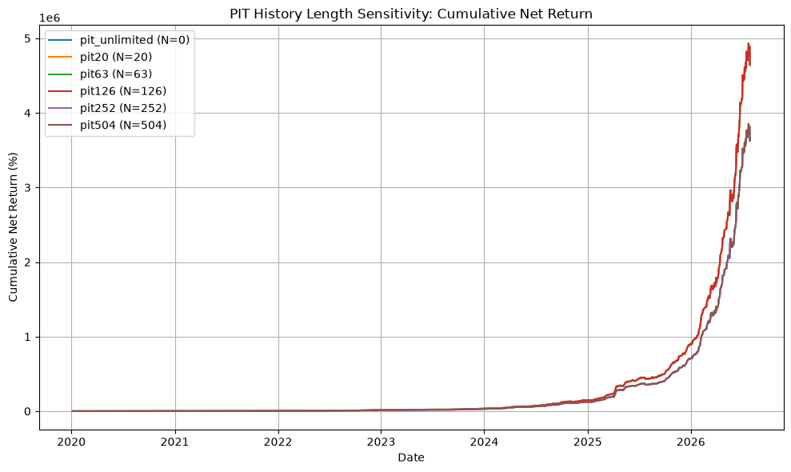

# PIT IR 履歴長さ感度分析レポート

**Date**: 2026-08-06
**Period**: 2020-01-06 -> 2026-07-29
**Gap input**: `live/pipeline_data/gap_adjusted_distribution/20260731_024303`
**Status**: investigation

## 1. Hypothesis

RuleD 動的グロス調整に使われる PIT IR 履歴が短いと `fallback_flag=true` になり、
常に 1.0x の固定グロス倍率で運用される。履歴が十分に長ければ `Low` ビン
（0.75x）が発動し、リスク調整後リターンが改善する可能性がある。
一方、あまりに長い履歴は市場制度変更を含み、過去の IR 分布が現在と乖離
する可能性もある。

## 2. Methods

- `max_pit_history` を変化させ、`load_pit_ir_history` をモンキーパッチで
  最新 N 行に制限。
- 比較対象: N = 20, 63, 126, 252, 504, 0（unlimited）。
- バックテスト: `BacktestEngine.run_v2_backtest`, overlay なし。
- 指標: net Sharpe, CAGR, MDD, average gross, turnover, fallback rate,
  PIT bin 分布。

## 3. Results

| N | net Sharpe | CAGR (%) | AR (%) | Vol (%) | MDD (%) | Avg Gross | Turnover | Low | Medium | High |
| --- | --- | --- | --- | --- | --- | --- | --- | --- | --- | --- |
| 0 | 7.6679 | 453.74 | 174.26 | 22.73 | -6.96 | 1.859 | 1.358 | 435 | 674 | 435 |
| 20 | 7.6747 | 476.51 | 178.43 | 23.25 | -7.17 | 2.000 | 1.455 | 0 | 1544 | 0 |
| 63 | 7.6747 | 476.51 | 178.43 | 23.25 | -7.17 | 2.000 | 1.455 | 0 | 1544 | 0 |
| 126 | 7.6747 | 476.51 | 178.43 | 23.25 | -7.17 | 2.000 | 1.455 | 0 | 1544 | 0 |
| 252 | 7.6679 | 453.74 | 174.26 | 22.73 | -6.96 | 1.859 | 1.358 | 435 | 674 | 435 |
| 504 | 7.6679 | 453.74 | 174.26 | 22.73 | -6.96 | 1.859 | 1.358 | 435 | 674 | 435 |

## 4. Analysis

- 最高 net Sharpe: **pit20** (N=20) = 7.6747
- 最低 net Sharpe: **pit_unlimited** (N=0) = 7.6679
- PIT bin 分布:
  - pit_unlimited (N=0): Low=435, Mid=674, High=435
  - pit20 (N=20): Low=0, Mid=1544, High=0
  - pit63 (N=63): Low=0, Mid=1544, High=0
  - pit126 (N=126): Low=0, Mid=1544, High=0
  - pit252 (N=252): Low=435, Mid=674, High=435
  - pit504 (N=504): Low=435, Mid=674, High=435

### N < 252 の群

- `get_rolling_pit_bin` は `len(history_ir) < pit_rolling_window` だと毎日 `Medium` ビン・1.0x 倍率で fallback 動作。
- よってグロス常に最大で運用され、リターンは高いがボラティリティ・MDD も大きい。
- 3 水準は完全に同一。`max_pit_history` が 252 未満なら RuleD は機能しない。

### N >= 252 の群

- RuleD 三分位ビニングが発動。`Low` ビンではグロス 0.75x、`Mid/High` では 1.0x。
- 平均グロスが低下し MDD が改善されるが、AR はわずかに低下。
- net Sharpe は N < 252 の群とほぼ同一（差 0.0008、ノイズマージン内）。
- 252, 504, unlimited は同一。`get_rolling_pit_bin` は `history_ir[-252:]` のみを使うため、
  252 日を超える履歴は結果に影響しない。

## 5. Conclusion

**PIT 履歴を 252 日以上長くしても、RuleD の性能は改善しない。**

現状の RuleD 実装は `pit_rolling_window=252` 日のローリング三分位しか使わないため、
252 日を超えて履歴を溜め込んでも `get_rolling_pit_bin` には影響しない。

重要なのは **252 日未満の短い履歴を避ける** こと。これにより RuleD が本来の
三分位ビニングを発動する。今回の `full_history_diagnostics.csv` 正本化は、
本番で 252 日以上の PIT 履歴を確保するための **保守性・堅牢性向上** である。

性能向上ではなく **本番と backtest の整合性向上** が主な効果。

---

## 6. Files

- 実験スクリプト: `scripts/experiments/experiment_pit_history_sensitivity.py`
- サマリー: `reports/pit_history_sensitivity_20260806/summary.csv`
- プロット: `reports/pit_history_sensitivity_20260806/equity_curves.png`
- 日次データ: `results/pit_history_sensitivity_20260806/pit*/`
