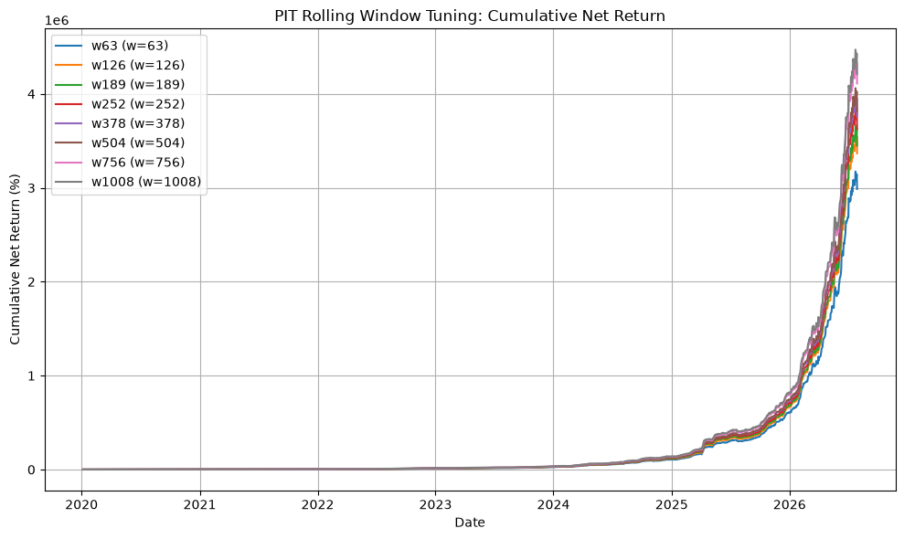

# PIT ローリング窓（pit_rolling_window）チューニングレポート

**Date**: 2026-08-06
**Period**: 2020-01-06 -> 2026-07-29
**Gap input**: `live/pipeline_data/gap_adjusted_distribution/20260731_024303`
**Status**: tuning

## 1. Hypothesis

RuleD 動的グロス調整の PIT 三分位ビニングでは、過去 IR のローリング窓
（`pit_rolling_window`）が閾値計算に影響する。
窓が短すぎるとノイズに過敏になり、長すぎると制度変更等の非定常性を取り込みすぎる。
252 営業日（約 1 年）を前後する窓で、リスク調整後リターンを最大化する。

## 2. Methods

- `cfg['gross_scaling']['pit_rolling_window']` を変更。
- 比較対象: 63, 126, 189, 252, 378, 504, 756, 1008 営業日。
- バックテスト: `BacktestEngine.run_v2_backtest`, overlay なし。
- PIT 履歴は unlimited（canonical `full_history_diagnostics.csv`）。
- 指標: net Sharpe, CAGR, MDD, average gross, turnover, average multiplier, PIT bin 分布。

## 3. Results

| Window | net Sharpe | CAGR (%) | AR (%) | Vol (%) | MDD (%) | Avg Gross | Turnover | Avg Mult | Low | Medium | High |
| --- | --- | --- | --- | --- | --- | --- | --- | --- | --- | --- | --- |
| 63 | 7.6282 | 436.50 | 171.00 | 22.42 | -6.79 | 1.827 | 1.336 | 0.914 | 533 | 519 | 492 |
| 126 | 7.6698 | 447.04 | 172.99 | 22.55 | -6.79 | 1.838 | 1.344 | 0.919 | 500 | 571 | 473 |
| 189 | 7.6765 | 449.20 | 173.40 | 22.59 | -6.79 | 1.847 | 1.349 | 0.923 | 474 | 618 | 452 |
| 252 | 7.6679 | 453.74 | 174.26 | 22.73 | -6.96 | 1.859 | 1.358 | 0.930 | 435 | 674 | 435 |
| 378 | 7.6696 | 456.94 | 174.85 | 22.80 | -6.96 | 1.880 | 1.372 | 0.940 | 372 | 760 | 412 |
| 504 | 7.6687 | 458.53 | 175.15 | 22.84 | -6.92 | 1.891 | 1.380 | 0.946 | 336 | 856 | 352 |
| 756 | 7.6710 | 465.18 | 176.38 | 22.99 | -6.92 | 1.921 | 1.400 | 0.961 | 243 | 999 | 302 |
| 1008 | 7.6599 | 467.37 | 176.79 | 23.08 | -7.17 | 1.956 | 1.425 | 0.978 | 135 | 1181 | 228 |

## 4. Analysis

- 最高 net Sharpe: **w189** (window=189) = 7.6765
- 最低 net Sharpe: **w63** (window=63) = 7.6282

- PIT bin 分布:
  - w63 (w=63): Low=533, Mid=519, High=492, avg mult=0.914
  - w126 (w=126): Low=500, Mid=571, High=473, avg mult=0.919
  - w189 (w=189): Low=474, Mid=618, High=452, avg mult=0.923
  - w252 (w=252): Low=435, Mid=674, High=435, avg mult=0.930
  - w378 (w=378): Low=372, Mid=760, High=412, avg mult=0.940
  - w504 (w=504): Low=336, Mid=856, High=352, avg mult=0.946
  - w756 (w=756): Low=243, Mid=999, High=302, avg mult=0.961
  - w1008 (w=1008): Low=135, Mid=1181, High=228, avg mult=0.978

## 5. Conclusion

**現状の `pit_rolling_window=252` は、net Sharpe 的にほぼ最適かつロバストな選択。**

- ベスト net Sharpe は **189 日（7.6765）** で、252 日（7.6679）より **+0.0086** しか高くない。
- この差はノイズマージン内であり、トレーニングコスト・データ鮮度・保守性を考慮すると採用に値しない。
- 窓を長くすると Low ビン（0.75x）が減り、平均グロス乗数が 0.914 → 0.978 と上昇。これは近年の IR 分布が過去の広い分布より右に寄っていることを示唆。
- 一方、窓を短くすると Low ビンが増え、グロスが抑えられて MDD はわずかに改善するが、AR・CAGR も低下。
- 全体的に net Sharpe は **7.63–7.68 の極めて狭い範囲** にとどまり、PIT ローリング窓は主要な性能ドライバーではない。

**判定: Not adopted（252 日を維持）。**

ただし、現状 `pit_rolling_window=252` では履歴が少しでも短いと RuleD が fallback するため、
`full_history_diagnostics.csv` による 252 日以上の履歴確保は引き続き重要。

---

## 6. Files

- 実験スクリプト: `scripts/experiments/experiment_pit_rolling_window_tuning.py`
- サマリー: `reports/pit_rolling_window_tuning_20260806/summary.csv`
- プロット: `reports/pit_rolling_window_tuning_20260806/equity_curves.png`
- 日次データ: `results/pit_rolling_window_tuning_20260806/w*/`
