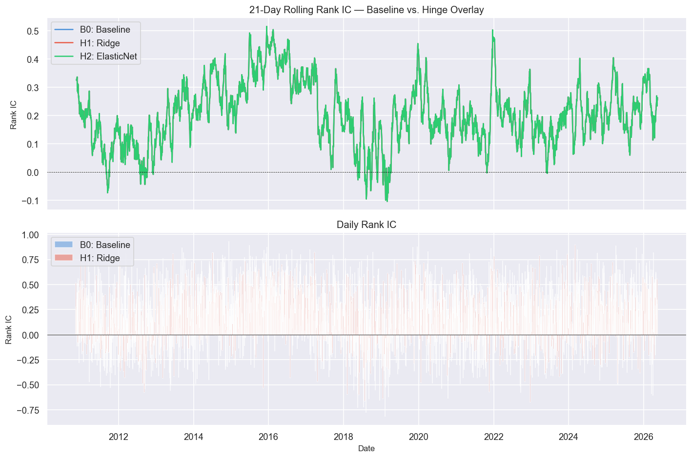
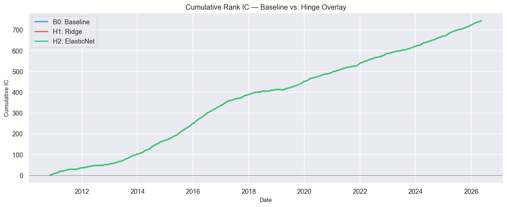
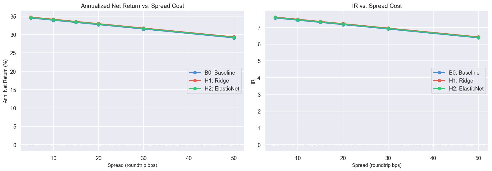
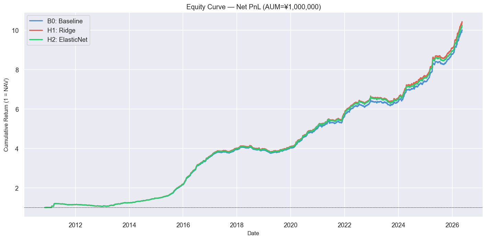
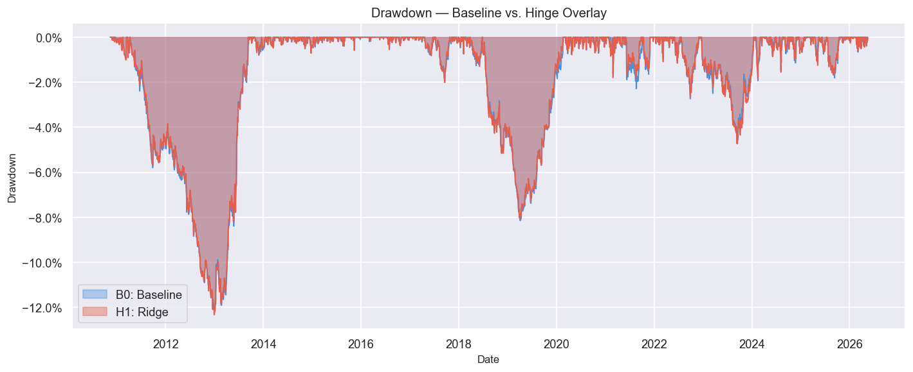
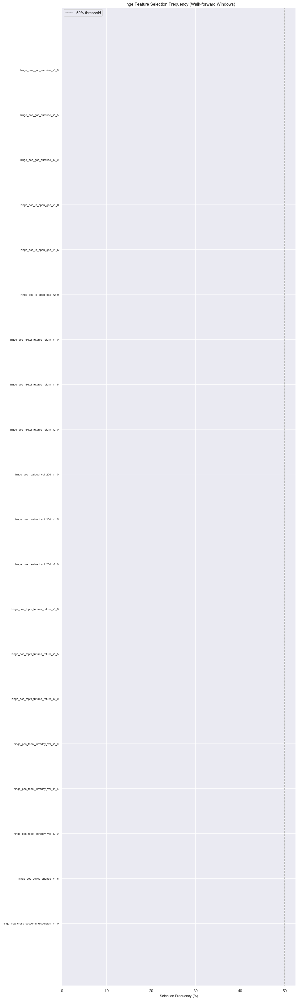
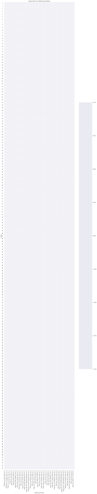

# Sprint 3-A — ヒンジ特徴量による限定的非線形化検証レポート

**生成日時**: 2026-06-23 19:33  
**検証期間**: 2009-07-10 ～ 2026-05-28  
**AUM**: ¥1,000,000  

---
## 1. 概要

本レポートは Sprint 3-A として実施した、ヒンジ特徴量による **conservative nonlinear overlay** の検証結果をまとめたものです。

既存 baseline モデル `net_score_ranking` の予測力を置き換えるのではなく、米国セクター・マクロ・ギャップ・レジーム指標が閾値を超えた局面のみを補正する overlay をRidge / ElasticNet で実装し、walk-forward OOS で検証しました。

---
## 2. 目的

1. 日中残差リターンの Rank IC が改善するか
2. 分位リターンの単調性が改善するか
3. AUM 1,000,000円・固定スプレッド 10/15/20/30bps 条件で net return / IR / max DD が改善するか
4. DD を悪化させずにコスト控除後リターンが改善するか
5. 選択特徴量が walk-forward 期間を通じて安定しているか
6. 過学習の兆候がないか

---
## 3. ターゲット定義

| ターゲット | 説明 | 使用方法 |
|-----------|------|----------|
| `open_to_close_residual` | Open→Close 日中残差リターン (beta 控除) | **主要ターゲット** |
| `entry_to_close_residual` | Entry→Close 残差 (9:10 proxy / Open) | サブターゲット |
| `close_to_close_return` | 前日終値→当日終値 | **参照のみ**（リーク防止） |
| `true_0910_to_close_residual` | 真の 9:10 価格からの残差 | サブサンプル報告 |

> **注意**: Close-to-Close を主ターゲットにすることは禁止されています。

---
## 4. Baseline モデル

```
Model B0: net_score_ranking
  score_long  = signal_gap_adjusted - lambda * tc_long_roundtrip
  score_short = -signal_gap_adjusted - lambda * tc_short_roundtrip
  Select top-5 long / top-5 short by score
  Weights proportional to score, normalized to target gross
```

**Baseline 性能 (OOS)**:

- Annualized Net Return: 15.91%
- IR: 3.4923
- Max Drawdown: -12.17%
- Mean Rank IC: 0.2036

---
## 5. ヒンジ特徴量設計

**閾値 (kappa)**: [1.0, 1.5, 2.0]
**方向**: positive (`max(0, z-κ)`), negative (`max(0, -z-κ)`)

### 特徴量グループ

**us_sector** (有効): us_tech_return, us_semiconductor_return, us_energy_return, us_financial_return, us_industrial_return, us_healthcare_return, us_smallcap_return

**macro** (有効): us10y_change, usd_jpy_return, vix_return, nikkei_futures_return, topix_futures_return

**gap** (有効): jp_open_gap, entry_gap, gap_adjustment_term, gap_surprise

**regime** (有効): realized_vol_20d, cross_sectional_dispersion, topix_intraday_vol


### 出力列名の例

```
hinge_pos_us_tech_return_k1_0
hinge_neg_us_tech_return_k1_0
hinge_pos_us_tech_return_k1_5
hinge_neg_vix_return_k2_0
... 合計最大 40 特徴量
```

---
## 6. Rolling z-score と Look-ahead 防止

$$
z_{k,t} = \frac{x_{k,t} - \mu_{k,t-1}^{roll}}{\sigma_{k,t-1}^{roll}}
$$

**実装上の制約**:

- rolling mean/std には `shift(1)` を適用し、当日データを含めない
- std がゼロ or NaN → 当日 z-score は NaN
- rolling window: 120 日
- full-sample zscore は **禁止**

---
## 7. FDR Feature Selection

手法: **Benjamini-Hochberg FDR** (q = 0.1)

各 walk-forward train window 内のみで実施:
1. 各ヒンジ特徴量 × target の日次 cross-sectional Rank IC を計算
2. 平均 Rank IC、ICIR、t 検定 p 値を算出
3. BH FDR 補正を適用
4. `q <= 0.1` かつ `|mean_rank_ic| >= 0.02`
5. train window を前半/後半に分け、符号一致率 >= 0.6
6. 最大 20 特徴量を使用

**検証 window 数**: 175

---
## 8. Ridge / ElasticNet Overlay 仕様

### 残差ターゲット
$$
e_{j,t} = y^{intraday\_resid}_{j,t} - \hat{\mu}^{base}_{j,t}
$$

### 最終予測
$$
\hat{\mu}^{final}_{j,t} = \hat{\mu}^{base}_{j,t} + \alpha \cdot \hat{e}_{j,t}
$$

$\alpha \in [0.0, 0.25, 0.5, 0.75, 1.0]$ (validation で選択)

### 補正上限（保守的制約）
```
abs(delta) <= 0.5 * abs(mu_base)
abs(delta) <= 20 bps
→ どちらか厳しい方を適用
```

| モデル | 正則化 | ハイパーパラメータ |
|--------|--------|-------------------|
| H1: Ridge | L2 | alpha ∈ [0.1, 1.0, 10.0, 100.0] |
| H2: ElasticNet | L1+L2 | alpha ∈ [0.0001, 0.001, 0.01, 0.1], l1_ratio ∈ [0.1, 0.3, 0.5, 0.7] |

---
## 9. Walk-forward 検証設計

```
Train window:       252 days
Validation window:  63 days
Test window:        21 days
Step:               21 days
Purge:              1 days

Train  → zscore param, FDR selection, model fit
Val    → Ridge/ElasticNet params + alpha blend selection
Test   → OOS prediction (no future leakage)
```

> **制約**: 同日内の銘柄を train/test に分割しない。test window は完全 OOS。

---
## 10. Rank IC / ICIR 比較

| モデル | Mean Rank IC | ICIR | Hit Rate |
|--------|-------------|------|---------|
| B0: Baseline | 0.2036 | 10.9607 | 55.37% |
| H1: Ridge | 0.2036 | 10.9607 | 55.92% |
| H2: ElasticNet | 0.2036 | 10.9607 | 55.92% |





---
## 11. 分位リターン比較

分位リターンデータ: not_available


---
## 12. AUM 100万円・固定スプレッド感応度

| Spread (bps) | B0 Net Return | H1 Ridge Net Return | H2 EN Net Return |
|-------------|--------------|---------------------|-----------------|
| 5 | 34.49% | 34.77% | 34.63% |
| 10 | 33.89% | 34.17% | 34.03% |
| 15 | 33.29% | 33.57% | 33.43% |
| 20 | 32.69% | 32.97% | 32.83% |
| 30 | 31.49% | 31.77% | 31.63% |
| 50 | 29.09% | 29.37% | 29.23% |



---
## 13. Reverse Fee 感応度

| Reverse Fee (bps/day) | B0 Net Return | H1 Ridge Net Return |
|----------------------|--------------|---------------------|
| 0 | not_available | not_available |
| 5 | not_available | not_available |
| 10 | not_available | not_available |
| 30 | not_available | not_available |


---
## 14. Max DD / Turnover / Effective Gross

| モデル | Max DD | Avg Turnover | Avg Effective Gross |
|--------|--------|-------------|---------------------|
| B0: Baseline | -12.17% | not_available | not_available |
| H1: Ridge | -12.33% | not_available | not_available |
| H2: ElasticNet | -12.22% | not_available | not_available |





---
## 15. 選択特徴量の安定性

| Feature | 選択頻度 | Mean Rank IC | Mean 符号一致率 |
|---------|---------|-------------|----------------|
| hinge_neg_cross_sectional_dispersion_k1_0 | 0.00% | not_available | not_available |
| hinge_pos_us10y_change_k1_5 | 0.00% | not_available | not_available |
| hinge_pos_topix_intraday_vol_k2_0 | 0.00% | not_available | not_available |
| hinge_pos_topix_intraday_vol_k1_5 | 0.00% | not_available | not_available |
| hinge_pos_topix_intraday_vol_k1_0 | 0.00% | not_available | not_available |
| hinge_pos_topix_futures_return_k2_0 | 0.00% | not_available | not_available |
| hinge_pos_topix_futures_return_k1_5 | 0.00% | not_available | not_available |
| hinge_pos_topix_futures_return_k1_0 | 0.00% | not_available | not_available |
| hinge_pos_realized_vol_20d_k2_0 | 0.00% | not_available | not_available |
| hinge_pos_realized_vol_20d_k1_5 | 0.00% | not_available | not_available |
| hinge_pos_realized_vol_20d_k1_0 | 0.00% | not_available | not_available |
| hinge_pos_nikkei_futures_return_k2_0 | 0.00% | not_available | not_available |
| hinge_pos_nikkei_futures_return_k1_5 | 0.00% | not_available | not_available |
| hinge_pos_nikkei_futures_return_k1_0 | 0.00% | not_available | not_available |
| hinge_pos_jp_open_gap_k2_0 | 0.00% | not_available | not_available |





---
## 16. True 9:10 サブサンプル結果

- True 9:10 サブサンプル日数: 47

True 9:10 サブサンプルで検証した場合の Mean Rank IC:
  - B0 Baseline: Rank IC = 0.1909
  - H1 Ridge: Rank IC = 0.1909
  - H2 ElasticNet: Rank IC = 0.1909

---
## 17. 過学習リスク評価

| リスク項目 | 評価 |
|-----------|------|
| rolling z-score に当日データ混入 | ✅ shift(1) で防止済 |
| full-sample zscore | ✅ 禁止・実装なし |
| FDR selection に test データ混入 | ✅ train window 内のみ |
| α blend に test データ混入 | ✅ validation window のみで選択 |
| overlay 過大 | ✅ cap_overlay による上限制約 |
| 特徴量多重検定 | ✅ BH FDR q=0.10 で制御 |
| test window の OOS 性 | ✅ 完全 OOS |

**リーク監査結果**:
- すべての監査項目: ✅ PASS

---
## 18. 採用可否判断

### 採用基準チェックリスト

- [ ] **Net return +3%以上改善**
- [ ] **IR +0.20以上改善**
- [ ] **Max DD 悪化なし**
- [ ] **Spread 15bps で baseline を上回る**
- [ ] **Spread 20bps で baseline を上回る**
- [ ] **Turnover +20%以下の増加**
- [ ] **walk-forward で特徴量安定**
- [ ] **過学習・リーク監査 PASS**

### H1 (Ridge) 採用判断: **⚠️ RESEARCH CANDIDATE**
  - Net return improvement 0.28% < 3.0%
  - IR improvement 0.0596 < 0.20
  - Max DD worsened by 0.15% (limit=0.0%)

### H2 (ElasticNet) 採用判断: **⚠️ RESEARCH CANDIDATE**
  - Net return improvement 0.15% < 3.0%
  - IR improvement 0.0327 < 0.20
  - Max DD worsened by 0.05% (limit=0.0%)

### 総合判断: **RESEARCH_CANDIDATE**

production 採用見送り。**research candidate** として保留し、追加データ蓄積後に再検証する。

---
## 19. 次のアクション

1. 🔍 追加データ取得: US セクター ETF の価格データ拡充
2. 🔍 特徴量グループの再評価 (macro / regime のみに絞る)
3. 🔍 train window 延長 (252 → 504 日) で安定性確認
4. 🔍 hinge_filter_only (H3) の実装による単純ルール比較
5. 🔍 コスト条件の見直し (gross 0.5 重視)

---
## Appendix: 実行設定

```yaml
start_date: 2009-07-10
end_date: 2026-05-28
aum_jpy: 1000000
train_window_days: 252
validation_window_days: 63
test_window_days: 21
hinge_thresholds: [1.0, 1.5, 2.0]
fdr_q: 0.1
default_spread_bps: 15
```
