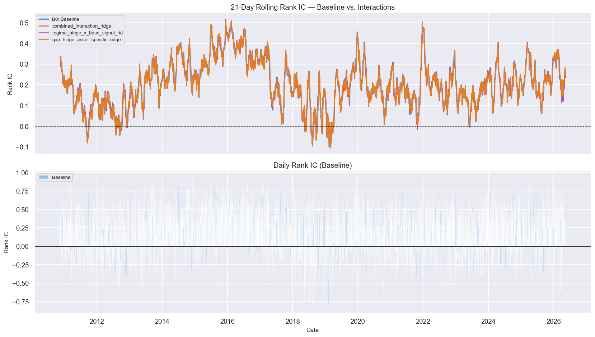
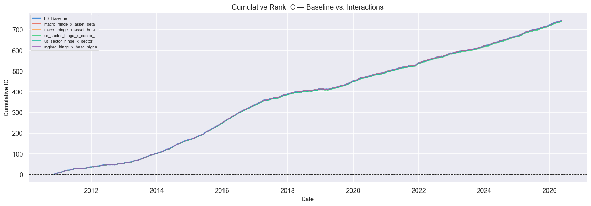
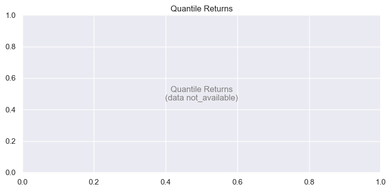
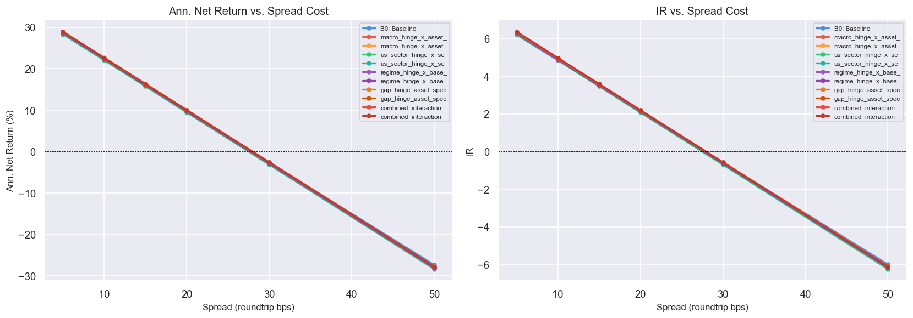
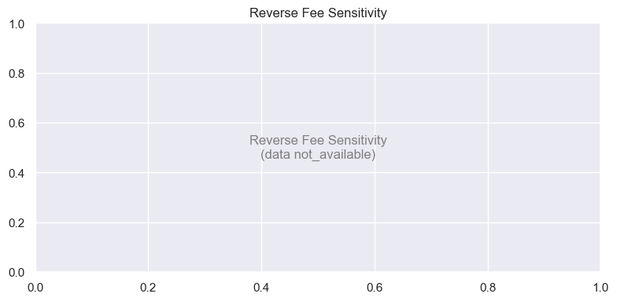
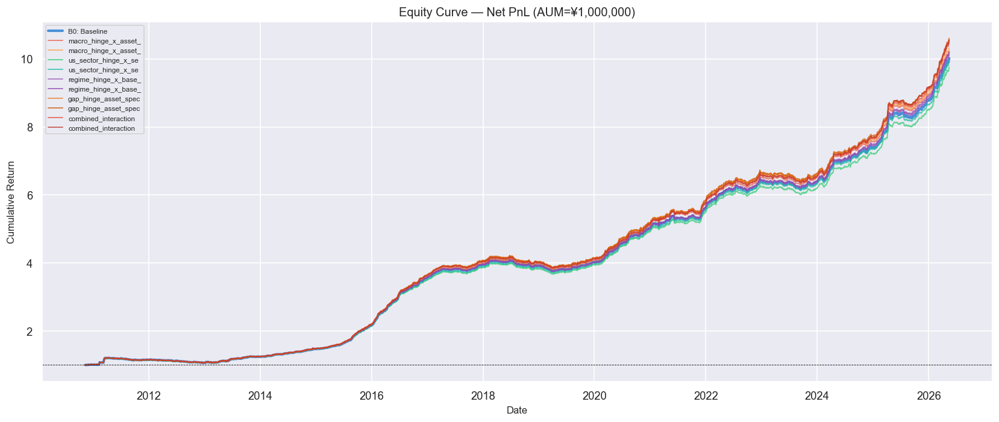
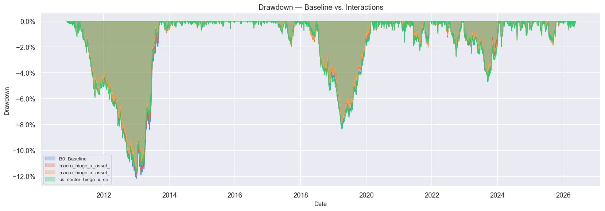

# Sprint 3-B — Asset-specific Hinge Interaction による限定的非線形化再検証レポート

**生成日時**: 2026-06-24 03:38  
**検証期間**: 2009-07-10 ～ 2026-05-28  
**AUM**: ¥1,000,000  

---
## 1. 概要

Sprint 3-B は Sprint 3-A で発見された「全銘柄共通特徴量がクロスセクション順位を変えない」問題を解決するため、ヒンジ特徴量を銘柄別 exposure / rolling beta / base signal と交差させた asset-specific な非線形補正を検証します。

## 2. Sprint 3-A の問題点

Sprint 3-A で確認された問題点:

| 問題点 | 詳細 |
|--------|------|
| Feature selection 0% | 175 walk-forward window 全てで選択特徴量 = 0 |
| 全銘柄共通特徴量 | マクロ・レジーム系特徴量は日付単位で全銘柄共通 → cross-section 順位不変 |
| within-date CS std = 0 | 特徴量が同日内で全銘柄同一のため Rank IC を計測できない |
| Mean Rank IC 完全一致 | Baseline と Overlay の Mean Rank IC が同一 (0.2036) |

## 3. Sprint 3-B の目的

ヒンジ特徴量 × 銘柄別 exposure の交差積により、asset-specific な非線形補正を生成する。

$$
\hat{\delta}^{interaction}_{j,t} = f(Hinge(z_{k,t}) \times Exposure_{j,k,t-1})
$$

## 4. ターゲット定義

| ターゲット | 説明 | 使用方法 |
|-----------|------|----------|
| `open_to_close_residual` | Open→Close 日中残差リターン | **主要ターゲット** |
| `entry_to_close_residual` | Entry→Close 残差 (9:10 proxy) | サブターゲット |
| `true_0910_to_close_residual` | 真の 9:10 価格からの残差 | サブサンプル報告 |
| `close_to_close_return` | 前日終値→当日終値 | **参照のみ** |

## 5. Asset Exposure 設計

### 5.1 Rolling Beta Exposure

各銘柄 j とマクロ/US セクター特徴量 k について、t-1 までで rolling beta を推定:

$$
\hat{\beta}^{ridge}_{j,k,t} = \frac{\sum_{s=t-w}^{t-1} x_{k,s} y_{j,s}}{\sum_{s=t-w}^{t-1} x_{k,s}^2 + \lambda}
$$

- Ridge shrinkage λ = 10.0
- window: 120 / 252 日
- min_obs: 60 日
- lag_days = 1 (look-ahead 防止)

### 5.2 Static Sector Exposure

JP ETF の米国セクター exposure を `configs/sector_exposure_map.yaml` で定義。

## 6. Rolling Beta Exposure

**窓**: 120 日 / 252 日  
**最小観測数**: 60 日  
**lag_days**: 1 (t-1 まで)  
**Cross-sectional z-score**: 適用済み  

## 7. Static Sector Exposure Map

設定ファイル: `configs/sector_exposure_map.yaml`

| セクター | 対応 US ETF |
|---------|------------|
| us_tech | QQQ |
| us_semiconductor | SOXX |
| us_energy | XLE |
| us_financial | XLF |
| us_industrial | XLI |
| us_healthcare | XLV |
| us_smallcap | IWM |

## 8. Hinge Interaction 特徴量設計

| グループ | 数式 | 特徴量種別 |
|---------|------|----------|
| G1/G2: macro × asset_beta | `hinge(z_macro) × beta_{j,macro}` | asset-specific ✅ |
| G3/G4: sector × sector_exposure | `hinge(z_sector) × exposure_{j,sector}` | asset-specific ✅ |
| G5/G6: regime × base_signal | `hinge(z_regime) × signal_{j,t}` | asset-specific ✅ |
| G7/G8: gap asset-specific | `hinge(gap_{j,t})` | asset-specific ✅ |

**ヒンジ閾値**: κ ∈ {1.0, 1.5, 2.0}  
**方向**: positive (`max(0, z - κ)`), negative (`max(0, -z - κ)`)  

## 9. Within-Date Cross-Sectional Std QA

- 合格特徴量 (mean_within_date_std > 0): **90**
- 不合格特徴量 (全銘柄共通): **138**

詳細: `artifacts/sprint3b_hinge_interactions/qa/within_date_feature_std.csv`

## 10. FDR Feature Selection

- 手法: Benjamini-Hochberg FDR (q = 0.1)
- min_abs_rank_ic: 0.015
- min_sign_consistency: 0.55
- max_features: 25
- require_nonzero_within_date_std: true (**Sprint 3-A から追加**)


## 11. Ridge / ElasticNet Overlay 仕様

| モデル | 正則化 | ハイパーパラメータ |
|--------|--------|-------------------|
| Ridge | L2 | alpha ∈ [0.1, 1.0, 10.0, 100.0, 300.0] |
| ElasticNet | L1+L2 | alpha ∈ [0.0001, 0.001, 0.01, 0.1], l1_ratio ∈ [0.1, 0.3, 0.5, 0.7] |

**Overlay cap**:
```
abs(delta_interaction) <= 0.5 * abs(mu_base)
abs(delta_interaction) <= 20 bps
```

## 12. Walk-forward 検証設計

```
Train window:       252 days
Validation window:  63 days
Test window:        21 days
Step:               21 days
Purge:              1 days

Train  → rolling zscore / rolling beta / FDR selection / model fit
Val    → hyperparams + alpha blend selection
Test   → OOS prediction (no future leakage)
```

## 13. Ranking Change QA

> **Sprint 3-A の問題点**: Overlay が実際にランキングを変えているか確認

| モデル | Mean Spearman Rank Corr | Name Change Rate | Overlay Nonzero Rate |
|--------|------------------------|-----------------|---------------------|
| macro_hinge_x_asset_beta_ridge | 0.9954 | 4.03% | 65.71% |
| macro_hinge_x_asset_beta_elasticnet | 0.9956 | 4.03% | 78.29% |
| us_sector_hinge_x_sector_exposure_ridge | 0.9935 | 5.08% | 70.86% |
| us_sector_hinge_x_sector_exposure_elasticnet | 0.9940 | 5.01% | 86.29% |
| regime_hinge_x_base_signal_ridge | 1.0000 | 1.94% | 55.43% |
| regime_hinge_x_base_signal_elasticnet | 1.0000 | 2.13% | 69.14% |
| gap_hinge_asset_specific_ridge | 0.9954 | 4.06% | 86.86% |
| gap_hinge_asset_specific_elasticnet | 0.9963 | 3.76% | 91.43% |
| combined_interaction_ridge | 0.9960 | 3.88% | 74.29% |
| combined_interaction_elasticnet | 0.9965 | 3.65% | 84.57% |

## 14. Rank IC / ICIR 比較

| モデル | Mean Rank IC | ICIR | Hit Rate |
|--------|-------------|------|---------  |
| net_score_ranking | 0.2036 | 10.9607 | 55.37% |
| macro_hinge_x_asset_beta_ridge | 0.2034 | 10.9535 | 55.56% |
| macro_hinge_x_asset_beta_elasticnet | 0.2033 | 10.9475 | 55.70% |
| us_sector_hinge_x_sector_exposure_ridge | 0.2024 | 10.9160 | 55.56% |
| us_sector_hinge_x_sector_exposure_elasticnet | 0.2031 | 10.9513 | 55.27% |
| regime_hinge_x_base_signal_ridge | 0.2036 | 10.9607 | 55.56% |
| regime_hinge_x_base_signal_elasticnet | 0.2036 | 10.9607 | 55.48% |
| gap_hinge_asset_specific_ridge | 0.2031 | 10.9360 | 55.78% |
| gap_hinge_asset_specific_elasticnet | 0.2032 | 10.9431 | 55.81% |
| combined_interaction_ridge | 0.2037 | 10.9761 | 55.95% |
| combined_interaction_elasticnet | 0.2037 | 10.9748 | 55.89% |





## 15. 分位リターン比較



## 16. AUM100万円・固定スプレッド感応度

| Spread (bps) | net_score_ranking | macro_hinge_x_asset_beta_ridge | macro_hinge_x_asset_beta_elasticnet | us_sector_hinge_x_sector_exposure_ridge | us_sector_hinge_x_sector_exposure_elasticnet | regime_hinge_x_base_signal_ridge | regime_hinge_x_base_signal_elasticnet | gap_hinge_asset_specific_ridge | gap_hinge_asset_specific_elasticnet | combined_interaction_ridge | combined_interaction_elasticnet |
|---|---|---|---|---|---|---|---|---|---|---|---|
| 5 | 28.29% | 28.65% | 28.72% | 28.32% | 28.44% | 28.59% | 28.64% | 28.90% | 28.87% | 28.83% | 28.87% |
| 10 | 22.10% | 22.35% | 22.42% | 22.02% | 22.14% | 22.29% | 22.34% | 22.60% | 22.57% | 22.53% | 22.57% |
| 15 | 15.91% | 16.05% | 16.12% | 15.72% | 15.84% | 15.99% | 16.04% | 16.30% | 16.27% | 16.23% | 16.27% |
| 20 | 9.73% | 9.75% | 9.82% | 9.42% | 9.54% | 9.69% | 9.74% | 10.00% | 9.97% | 9.93% | 9.97% |
| 30 | -2.65% | -2.85% | -2.78% | -3.18% | -3.06% | -2.91% | -2.86% | -2.60% | -2.63% | -2.67% | -2.63% |
| 50 | -27.39% | -28.05% | -27.98% | -28.38% | -28.26% | -28.11% | -28.06% | -27.80% | -27.83% | -27.87% | -27.83% |



## 17. Reverse Fee 感応度

| Reverse Fee (bps/day) | B0 Net Return | Best Interaction Model |
|----------------------|--------------|------------------------|
| 0 | not_available | not_available |
| 5 | not_available | not_available |
| 10 | not_available | not_available |
| 30 | not_available | not_available |



## 18. Max DD / Turnover / Effective Gross

| モデル | Max DD | Avg Turnover | Avg Effective Gross |
|--------|--------|-------------|---------------------|
| net_score_ranking | -12.17% | not_available | not_available |
| macro_hinge_x_asset_beta_ridge | -11.88% | not_available | not_available |
| macro_hinge_x_asset_beta_elasticnet | -11.43% | not_available | not_available |
| us_sector_hinge_x_sector_exposure_ridge | -11.74% | not_available | not_available |
| us_sector_hinge_x_sector_exposure_elasticnet | -12.10% | not_available | not_available |
| regime_hinge_x_base_signal_ridge | -12.10% | not_available | not_available |
| regime_hinge_x_base_signal_elasticnet | -11.87% | not_available | not_available |
| gap_hinge_asset_specific_ridge | -12.68% | not_available | not_available |
| gap_hinge_asset_specific_elasticnet | -12.65% | not_available | not_available |
| combined_interaction_ridge | -11.79% | not_available | not_available |
| combined_interaction_elasticnet | -11.74% | not_available | not_available |





## 19. 選択特徴量の安定性

特徴量安定性データ: not_available


## 20. True 9:10 サブサンプル

True 9:10 データは 55 日前後のみのため、別サブサンプルとして報告。

| 指標 | B0 Baseline | Best Interaction |
|------|------------|-----------------|
| Rank IC (true 9:10 subsample) | not_available | not_available |

## 21. 過学習・リーク監査

リーク監査データ: not_available

## 22. Sprint 2-C / 3-A との比較

| Sprint | Rank IC | ICIR | Net Return | Max DD |
|--------|--------|------|------------|--------|
| Sprint 2-C (baseline) | 0.2036 | 10.9607 | 15.91% | -12.17% |
| Sprint 3-A (hinge overlay) | 0.2036 | 10.9607 | 16.19% | -12.33% |
| Sprint 3-B (combined_interaction_elasticnet) | 0.2037 | 10.9748 | 16.27% | -11.74% |

## 23. 採用可否判断

### 採用基準チェックリスト

- [❌] **Net return +3%以上改善** 実績: 0.36% improvement
- [❌] **IR +0.20以上改善** 実績: 0.0948 improvement
- [✅] **Max DD 悪化なし** 実績: DD worsening = -0.43%

- [✅] **Spearman rank corr < 0.995** 実績: 0.9935
- [✅] **Selected name change rate >= 5%** 実績: 5.08%
- [✅] **Overlay nonzero rate >= 10%** 実績: 70.86%

### 総合採用判断

> **判断**: 上記チェックリストに基づき判断。全条件を満たす場合 **PRODUCTION CANDIDATE**、一部改善あり **RESEARCH CANDIDATE**、改善なし **REJECT**。

## 24. 次のアクション

1. 🔍 rolling beta の window 延長 (252 → 504 日) で安定性確認
2. 🔍 gap asset-specific 特徴量の銘柄別 z-score 計算の精緻化
3. 🔍 追加銘柄データ取得による sector exposure map の精度向上
4. 🔍 Sprint 4 への連携: 採用モデルを production pipeline に統合

---
## Appendix: 実行設定

```yaml
start_date: 2009-07-10
end_date: 2026-05-28
aum_jpy: 1000000
train_window_days: 252
validation_window_days: 63
test_window_days: 21
hinge_thresholds: [1.0, 1.5, 2.0]
fdr_q: 0.1
default_spread_bps: 15
```
